# Post-quantum algorithm negotiation

Opt-in support for post-quantum and hybrid SSH algorithms: what the collection can manage, where
each piece runs, and how it interacts with RHEL/Fedora crypto-policies.

Everything here is off by default. If you are not deliberately enabling PQC, you can ignore this
page entirely. Start at [README.md](README.md), or [QUICKSTART.md](QUICKSTART.md) for a first rotation.

`ssh_key_rotation_pqc_key_types` only affects local key *type* recognition in Phase 0. It never changes what `sshd` and `ssh` actually negotiate on the wire.

For a PQC or hybrid key to work end to end, both sides of the connection need matching algorithm lists across several independent layers. This collection can manage all of them:

| Variable | What it affects |
|----------|-----------------|
| `ssh_key_rotation_pqc_kex_algorithms` | `KexAlgorithms` in the target's `sshd_config`, and `-o KexAlgorithms` for this playbook's own connections |
| `ssh_key_rotation_pqc_pubkey_algorithms` | `PubkeyAcceptedAlgorithms` and `HostKeyAlgorithms` in the target's `sshd_config`, and `-o PubkeyAcceptedAlgorithms` for this playbook's own connections |
| `ssh_key_rotation_pqc_ca_signature_algorithms` | `CASignatureAlgorithms` in the target's `sshd_config`, for SSH CA setups only |
| `ssh_key_rotation_manage_crypto_policy` | Whether the RHEL/Fedora system-wide crypto-policy is also managed, on the control node and on targets |
| `ssh_key_rotation_crypto_policy_setting` | The value passed to `update-crypto-policies --set`, optionally combining a base policy with subpolicy modules using `BASE:MODULE` syntax, such as `DEFAULT:PQ` or `FIPS:PQ` |
| `ssh_key_rotation_crypto_policy_add_modules` | Preferred over the setting above: adds modules onto a host's current policy instead of replacing it |

Every `sshd_config` directive is written with OpenSSH's `+algorithm` syntax, appending to the compiled-in defaults rather than replacing the list outright, so clients that do not speak PQC yet can still fall back to a classical algorithm.

## Where each piece runs

The diagram below splits the work by stage and by machine. See [Role reference](README.md#role-reference) for how these map to `tasks/*.yml`.

```mermaid
flowchart TD
    subgraph P0["validate stage - control node, before any host is touched"]
        Vars{"Any PQC algorithms requested?"}
        Vars -->|"No"| Skip0["Nothing to do - skip straight to the install stage"]
        Vars -->|"Yes"| ControlCheck{"Does the control node's own ssh support them?"}
        ControlCheck -->|"No"| WarnLocal["Warn: negotiation may fail later"]
        ControlCheck -->|"Yes"| ControlPolicy{"Also manage the control node's crypto-policy?"}
        WarnLocal --> ControlPolicy
        ControlPolicy -->|"Yes"| ControlModuleCheck{"Does the policy need a subpolicy module, e.g. FIPS:PQ?"}
        ControlModuleCheck -->|"Yes"| ControlModuleGate["Fail now if that module isn't installed"]
        ControlModuleCheck -->|"No"| ControlApply["Apply the crypto-policy"]
        ControlModuleGate --> ControlApply
        ControlPolicy -->|"No"| ExtraArgs
        ControlApply --> ExtraArgs["Carry the algorithms into this playbook's own ssh connections"]
    end

    subgraph P1["install stage - target host, connected with the OLD key"]
        Record["Record pre-install state in /etc/ansible/facts.d"]
        Record --> WriteDropin["Write the algorithms to this role's drop-in
        (sshd_config itself is never edited)"]
        WriteDropin --> TargetPolicy{"Also manage the target's crypto-policy?"}
        TargetPolicy -->|"Yes"| TargetModuleCheck{"Does the policy need a subpolicy module?"}
        TargetModuleCheck -->|"Yes"| TargetModuleGate["Fail now if that module isn't installed"]
        TargetModuleCheck -->|"No"| TargetApply["Apply the crypto-policy"]
        TargetModuleGate --> TargetApply
        TargetApply --> Validate["Validate the MERGED sshd config"]
        TargetPolicy -->|"No"| Validate
        Validate --> Reload["Reload sshd"]
        Reload --> EffectiveCheck{"Did the algorithms actually take effect,
        and will sshd accept the new key's type?"}
        EffectiveCheck -->|"No"| InstallRollback["Roll back: remove this role's drop-in,
        restore authorized_keys, restore the crypto-policy"]
        EffectiveCheck -->|"Yes"| Reconnect
    end

    subgraph P2["verify stage - target host, reconnecting with the NEW key"]
        Reconnect{"Does the new key authenticate over the new algorithms?"}
        Reconnect -->|"No"| AbortVerify["Abort - old key and legacy auth left untouched"]
        Reconnect -->|"Yes"| RemoveOldKey["Back up, then remove the OLD key"]
        RemoveOldKey --> Cleanup["Optionally disable password/keyboard-interactive auth
        via a second drop-in"]
    end

    ExtraArgs --> Record
```



**On the control node, in Phase 0.** `ssh -Q kex` and `ssh -Q key-sig` confirm your own ssh binary can offer the algorithms you are asking for, before any host is touched. If `ssh_key_rotation_manage_crypto_policy` is set and this is a RHEL or Fedora control node, `update-crypto-policies --set` runs there too, so the machine's ssh *client* backend permits PQC algorithms system-wide. This is detected by checking whether the `update-crypto-policies` tool exists, not by an OS-family fact.

**On the connection itself.** The algorithms need to travel with the Ansible connection. Rather than editing any file on the control node, Phases 1 and 2 compute an `ansible_ssh_extra_args` value that passes `-o KexAlgorithms=+...` and `-o PubkeyAcceptedAlgorithms=+...` for this playbook's connections only.

**On the target, in Phase 1.** `KexAlgorithms`, `PubkeyAcceptedAlgorithms`, `HostKeyAlgorithms` and `CASignatureAlgorithms` are appended to `sshd_config`, using the same `lineinfile` plus `sshd -t` plus backup pattern used everywhere else.

If `ssh_key_rotation_manage_crypto_policy` is set and the target has the tooling, the crypto-policy step runs there too. Because `update-crypto-policies --set` validates only its own module syntax and not the resulting merged `sshd_config`, there is an explicit `sshd -t` re-check afterwards, before the reload handler is allowed to fire. The drop-in warning also calls out `50-redhat.conf` by name, since that file is the generated crypto-policy backend include and is not meant to be hand-edited.

Once `sshd` has reloaded, the `sshd -T` check flags any requested algorithm that still is not showing up in the effective config, so you find out before Phase 2 tries and fails to reconnect.

## Combining a base policy with a subpolicy module

`update-crypto-policies --set` accepts either a base policy name on its own (`DEFAULT`, `FIPS`, `LEGACY` and so on) or a base policy combined with one or more subpolicy *modules*, written as `BASE:MODULE`. For example `FIPS:PQ`, or `FIPS:PQ:NO-SHA1` to stack more than one.

Each module is a `MODULE.pmod` file, either shipped by the OS under `/usr/share/crypto-policies/policies/modules/` or dropped in locally under `/etc/crypto-policies/policies/modules/`. A module is added on top of the base policy rather than replacing it, so `FIPS:PQ` stays FIPS-compliant everywhere else and only adds what `PQ.pmod` grants.

This matters specifically for PQC. On AlmaLinux and RHEL 9, the `FIPS` policy alone includes no post-quantum key-exchange groups, but the OS still ships a built-in `PQ.pmod` that adds `mlkem768x25519-sha256` and other ML-KEM groups when combined as `FIPS:PQ`. This was confirmed against a real AlmaLinux 9.8 host, where `sshd -T` only showed `mlkem768x25519-sha256` in the effective `KexAlgorithms` after switching from `FIPS` to `FIPS:PQ`. AlmaLinux and RHEL 10 ship PQC key exchange in `FIPS` already, so the combination is not needed there.

Before ever calling `update-crypto-policies --set`, the playbook lists whatever `*.pmod` files exist under both module directories on that host, the control node in Phase 0 and the target in Phase 1. If `ssh_key_rotation_crypto_policy_setting` names a module that is not present, it fails before making any change, rather than letting `update-crypto-policies` silently ignore an unknown module name or fail in a way that is easy to miss in the task output.

## Examples

All three run the same command as [Usage](README.md#usage); only `rotation_vars.yml` differs.

**Enable a PQC key-exchange algorithm:**

```yaml
ssh_key_rotation_pqc_kex_algorithms:
  - mlkem768x25519-sha256
```

**Manage the RHEL/Fedora crypto-policy as well:**

```yaml
ssh_key_rotation_manage_crypto_policy: true
ssh_key_rotation_crypto_policy_setting: "DEFAULT:PQ"
```

**Add PQC to a FIPS-mode host,** keeping the rest of FIPS intact. Note the new key must be
ECDSA or RSA here, since FIPS does not accept ed25519:

```yaml
new_private_key:     "./pwc_id_ecdsa"
new_public_key_file: "./pwc_id_ecdsa.pub"
ssh_key_rotation_manage_crypto_policy: true
ssh_key_rotation_crypto_policy_add_modules:
  - PQ
```
