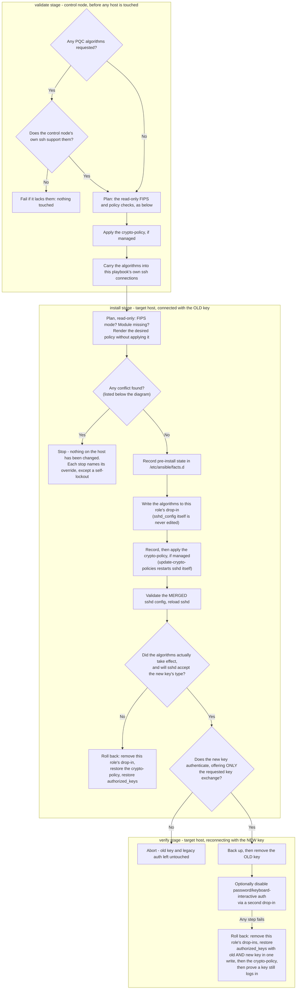

# Post-quantum algorithm negotiation

Opt-in support for post-quantum and hybrid SSH algorithms: what the collection can manage, where
each piece runs, and how it interacts with RHEL/Fedora crypto-policies.

Everything here is off by default. If you are not deliberately enabling PQC, you can ignore this
page entirely. Start at [README.md](README.md), or [QUICKSTART.md](QUICKSTART.md) for a first rotation.

`ssh_key_rotation_pqc_key_types` only affects local key *type* recognition in Phase 0. It never changes what `sshd` and `ssh` actually negotiate on the wire.

For a PQC or hybrid key to work end to end, both sides of the connection need matching algorithm lists across several independent layers. This collection can manage all of them:

| Variable | What it affects |
|----------|-----------------|
| `ssh_key_rotation_pqc_kex_algorithms` | `KexAlgorithms` in the target's `sshd_config`, and `-o KexAlgorithms` for this playbook's own connections |
| `ssh_key_rotation_pqc_pubkey_algorithms` | `PubkeyAcceptedAlgorithms` and `HostKeyAlgorithms` in the target's `sshd_config`, and `-o PubkeyAcceptedAlgorithms` for this playbook's own connections |
| `ssh_key_rotation_pqc_ca_signature_algorithms` | `CASignatureAlgorithms` in the target's `sshd_config`, for SSH CA setups only |
| `ssh_key_rotation_manage_crypto_policy` | Whether the RHEL/Fedora system-wide crypto-policy is also managed, on the control node and on targets |
| `ssh_key_rotation_crypto_policy_setting` | The value passed to `update-crypto-policies --set`, optionally combining a base policy with subpolicy modules using `BASE:MODULE` syntax, such as `DEFAULT:PQ` or `FIPS:PQ` |
| `ssh_key_rotation_crypto_policy_add_modules` | Preferred over the setting above: adds modules onto a host's current policy instead of replacing it |
| `ssh_key_rotation_pqc_require_effective` | `true` by default: a requested algorithm that is not in effect fails and rolls back instead of silently falling back to a classical one |
| `ssh_key_rotation_allow_non_fips_algorithms` | `false` by default, so on a FIPS-mode kernel the role stops on anything outside the host's `FIPS` policy. See [FIPS-mode hosts](#fips-mode-hosts) |
| `ssh_key_rotation_accept_fips_validation_gap` | `false` by default, so the role stops on an AlmaLinux or Rocky Linux host in FIPS mode. See [FIPS mode is not FIPS validation](#fips-mode-is-not-fips-validation) |
| `ssh_key_rotation_allow_pqc_only_kex` | `false` by default, so the role stops on a policy that leaves only post-quantum key exchange. See [Policies that cut clients off](#policies-that-cut-clients-off) |

Every `sshd_config` directive is written with OpenSSH's `+algorithm` syntax, appending to the compiled-in defaults rather than replacing the list outright, so clients that do not speak PQC yet can still fall back to a classical algorithm.

## Where each piece runs

The diagram below splits the work by stage and by machine. See [Role reference](README.md#role-reference) for how these map to `tasks/*.yml`.


```mermaid
flowchart TD
    subgraph P0["validate stage - control node, before any host is touched"]
        Vars{"Any PQC algorithms requested?"}
        Vars -->|"Yes"| ControlCheck{"Does the control node's own ssh support them?"}
        ControlCheck -->|"No"| FailLocal["Fail if it lacks them: nothing touched"]
        ControlCheck -->|"Yes"| ControlPlan["Plan: the read-only FIPS and policy checks, as below"]
        Vars -->|"No"| ControlPlan
        ControlPlan --> ControlApply["Apply the crypto-policy, if managed"]
        ControlApply --> ExtraArgs["Carry the algorithms into this playbook's own ssh connections"]
    end

    subgraph P1["install stage - target host, connected with the OLD key"]
        Plan["Plan, read-only: FIPS mode? Module missing?
        Render the desired policy without applying it"]
        Plan --> PlanCheck{"Any conflict found?
        (listed below the diagram)"}
        PlanCheck -->|"Yes"| Refuse["Stop - nothing on the host has been changed.
        Each stop names its override, except a self-lockout"]
        PlanCheck -->|"No"| Record["Record pre-install state in /etc/ansible/facts.d"]
        Record --> WriteDropin["Write the algorithms to this role's drop-in
        (sshd_config itself is never edited)"]
        WriteDropin --> TargetApply["Record, then apply the crypto-policy, if managed
        (update-crypto-policies restarts sshd itself)"]
        TargetApply --> Validate["Validate the MERGED sshd config, reload sshd"]
        Validate --> EffectiveCheck{"Did the algorithms actually take effect,
        and will sshd accept the new key's type?"}
        EffectiveCheck -->|"No"| InstallRollback["Roll back: remove this role's drop-in,
        restore the crypto-policy, restore authorized_keys"]
        EffectiveCheck -->|"Yes"| Reconnect
    end

    subgraph P2["verify stage - target host, reconnecting with the NEW key"]
        Reconnect{"Does the new key authenticate, offering ONLY
        the requested key exchange?"}
        Reconnect -->|"No"| AbortVerify["Abort - old key and legacy auth left untouched"]
        Reconnect -->|"Yes"| RemoveOldKey["Back up, then remove the OLD key"]
        RemoveOldKey --> Cleanup["Optionally disable password/keyboard-interactive auth
        via a second drop-in"]
        Cleanup -->|"Any step fails"| VerifyRollback["Roll back: remove this role's drop-ins, restore
        authorized_keys with old AND new key in one write, then the crypto-policy,
        then prove a key still logs in"]
    end

    ExtraArgs --> Plan
```

The conflicts the plan stops on, before anything is changed: FIPS mode on AlmaLinux or Rocky Linux (see [FIPS mode is not FIPS validation](#fips-mode-is-not-fips-validation)); sshd offering anything a FIPS-mode host's `FIPS` policy leaves out (see [FIPS-mode hosts](#fips-mode-hosts)); a policy this playbook could no longer connect under, or one that leaves only post-quantum key exchange (see [Policies that cut clients off](#policies-that-cut-clients-off)); and a missing policy module.

**On the control node, in Phase 0.** `ssh -Q kex` and `ssh -Q key-sig` confirm your own ssh binary can offer the algorithms you are asking for, before any host is touched. If `ssh_key_rotation_manage_crypto_policy` is set and this is a RHEL or Fedora control node, `update-crypto-policies --set` runs there too, so the machine's ssh *client* backend permits PQC algorithms system-wide. This is detected by checking whether the `update-crypto-policies` tool exists, not by an OS-family fact.

**On the connection itself.** The algorithms need to travel with the Ansible connection. Rather than editing any file on the control node, Phases 1 and 2 compute an `ansible_ssh_extra_args` value that passes `-o KexAlgorithms=+...` and `-o PubkeyAcceptedAlgorithms=+...` for this playbook's connections only.

**On the target, in Phase 1.** `KexAlgorithms`, `PubkeyAcceptedAlgorithms`, `HostKeyAlgorithms` and `CASignatureAlgorithms` are written to this role's own drop-in under `/etc/ssh/sshd_config.d/`, validated with `sshd -t`, and removed again on rollback. `sshd_config` itself is only edited on hosts too old to support `Include`.

If `ssh_key_rotation_manage_crypto_policy` is set and the target has the tooling, the crypto-policy step runs there too. Note that `update-crypto-policies --set` restarts sshd by itself, so the new policy is live for the very next connection, before this role reloads anything. That is why every check that could stop a lockout runs in a read-only plan *before* the first change to the host, not after the apply. Because `update-crypto-policies --set` validates only its own module syntax and not the resulting merged `sshd_config`, there is also an explicit `sshd -t` afterwards. The drop-in warning calls out `50-redhat.conf` by name, since that file is the generated crypto-policy backend include and is not meant to be hand-edited.

Once `sshd` has reloaded, `sshd -T` must list every requested algorithm. If one is missing the install stage fails and rolls back, including the crypto-policy. It used to only warn, and the rotation then completed with every connection silently falling back to a classical algorithm. On RHEL-family hosts this is the normal result of requesting algorithms with the policy left alone: `40-redhat-crypto-policies.conf` is read before this role's drop-in, and sshd keeps the first value it sees. Set `ssh_key_rotation_pqc_require_effective: false` to get the old warning back.

In Phase 2, before the old key is removed, a fresh connection offers *only* the requested key exchange algorithms. Ansible's own connection appends them with `+`, so a classical fallback would satisfy it just as well; this probe passes only if post-quantum key exchange is really negotiated end to end.

## Combining a base policy with a subpolicy module

`update-crypto-policies --set` accepts either a base policy name on its own (`DEFAULT`, `FIPS`, `LEGACY` and so on) or a base policy combined with one or more subpolicy *modules*, written as `BASE:MODULE`. For example `FIPS:PQ`, or `FIPS:PQ:NO-SHA1` to stack more than one.

Each module is a `MODULE.pmod` file, either shipped by the OS under `/usr/share/crypto-policies/policies/modules/` or dropped in locally under `/etc/crypto-policies/policies/modules/`. A module is added on top of the base policy rather than replacing it, so `FIPS:PQ` stays FIPS-compliant everywhere else and only adds what `PQ.pmod` grants.

This matters specifically for PQC. RHEL 9.7 introduced the `PQ` subpolicy, which enables hybrid ML-KEM key exchange and pure ML-DSA signatures on top of any base policy, for example `update-crypto-policies --set DEFAULT:PQ`. On RHEL 9 and its rebuilds the `FIPS` policy alone includes no post-quantum key-exchange groups, and `FIPS:PQ` adds `mlkem768x25519-sha256`: on an AlmaLinux 9.8 host, `sshd -T` only showed it in the effective `KexAlgorithms` after switching from `FIPS` to `FIPS:PQ`. On a FIPS-mode kernel the role refuses this; see [FIPS-mode hosts](#fips-mode-hosts).

EL10 is different. Its base policies already enable ML-KEM (AlmaLinux 10.1's `DEFAULT` includes `mlkem768x25519-sha256`), so there is no `PQ` module at all, through 10.2. It ships `TEST-PQ`, which adds further experimental post-quantum algorithms and is not a renamed `PQ`, and from 10.1 `NO-PQ`, which removes ML-KEM and ML-DSA again. Asking for `PQ` on EL10 fails before anything is changed, with a message saying so. Its `FIPS` policy leaves `mlkem768x25519-sha256` out for OpenSSH.

From RHEL 10.2, the `FUTURE` policy allows *only* hybrid ML-KEM key exchange: every classical method is gone, and Red Hat notes that a `FUTURE` host cannot even reach `cdn.redhat.com`. Any SSH client without post-quantum support can no longer connect. The role stops before applying a policy like that; see [Policies that cut clients off](#policies-that-cut-clients-off).

Before ever calling `update-crypto-policies --set`, the playbook lists whatever `*.pmod` files exist under both module directories on that host, the control node in Phase 0 and the target in Phase 1. If the desired policy names a module that is not present, it fails before making any change, rather than letting `update-crypto-policies` silently ignore an unknown module name or fail in a way that is easy to miss in the task output.

On success the new policy is left in place. On rollback the previous one is put back; see [Limitations](README.md#limitations) for exactly when.

## FIPS-mode hosts

When the kernel is in FIPS mode (`/proc/sys/crypto/fips_enabled` is `1`), sshd only accepts what FIPS allows, whatever the configuration *offers*. If the configuration offers more, sshd advertises it and then rejects it mid-handshake. The sshd log shows, for example:

```text
input_kex_gen_init: Key exchange type mlkem768x25519 is not allowed in FIPS mode [preauth]
```

Every client that prefers that algorithm is disconnected. For `mlkem768x25519-sha256` that is every OpenSSH 9.9 or newer client, including the one Ansible uses. This was reproduced on AlmaLinux 10.1 with `fips_enabled=1`: `update-crypto-policies --set FIPS:TEST-PQ` locked out all modern clients the moment it ran, since it restarts sshd itself. Ansible reports that as UNREACHABLE rather than as a failed task, so no rollback can run, and the host can only be reached again from a client that does not offer ML-KEM.

To stop this happening, on a FIPS-mode host the role refuses, before changing anything:

- Any requested algorithm (`ssh_key_rotation_pqc_*_algorithms`) that is not in that host's own `FIPS` policy, read from `/usr/share/crypto-policies/FIPS/opensshserver.txt`. The host's `FIPS` policy is the authority on what its sshd supports in FIPS mode, so no algorithm list is hard-coded. On a FIPS host without crypto-policies, names using primitives FIPS does not approve (X25519, X448, sntrup, Ed25519, Ed448) are refused instead.
- Any crypto-policy change whose result would offer sshd anything outside that `FIPS` policy. The desired policy is rendered into a scratch directory with the package's own `build-crypto-policies.py`, without applying it, and compared. This refuses `FIPS:TEST-PQ` on AlmaLinux 10.1, and a base-policy switch such as `DEFAULT` or `DEFAULT:PQ`. Modules that only remove algorithms, such as `NO-PQ`, are allowed. If the desired policy cannot be rendered in advance, it is refused rather than guessed at.

The FIPS algorithm and policy checks also run on the control node, which is often a bastion people SSH into.

If you have console access and want to try anyway, `ssh_key_rotation_allow_non_fips_algorithms: true` turns these refusals off.

Whether a FIPS-mode host can use post-quantum key exchange for SSH is up to the distribution's FIPS policy and OpenSSH build. On AlmaLinux 10.1 it cannot: its `FIPS` policy's comment for OpenSSH reads "not supported in FIPS ATM". RHEL 10.2 adds the NIST-curve hybrids `mlkem768nistp256-sha256` and `mlkem1024nistp384-sha384` to OpenSSH and enables them in its `FIPS` policy, while `mlkem768x25519-sha256` stays excluded. Because the role compares against the host's own `FIPS` policy, requesting those on a 10.2 host in FIPS mode is allowed. Upstream OpenSSH (10.2 on Ubuntu 26.04, for instance) does not offer the NIST-curve hybrids, so the control node must run an OpenSSH that does.

### FIPS mode is not FIPS validation

`fips_enabled=1` means the kernel and crypto libraries enforce FIPS rules. It does not mean the modules doing the enforcing hold a FIPS 140-3 certificate, which is what a compliance requirement usually needs.

**FIPS validation gap on AlmaLinux 10.** Checked against NIST's CMVP lists in October 2026: AlmaLinux 9.2 and 9.6 have FIPS 140-3 validated modules, sponsored by TuxCare. For 9.2 these include the kernel (certificate #5441) and OpenSSL (#5482), which replaced the original #4750 and #4823; for 9.6, for example, OpenSSL (#5373). The validated packages come from the TuxCare repository, free for non-commercial use; commercial use and ongoing patching that stays inside the validated boundary need paid TuxCare Enterprise Support. No AlmaLinux 10.x module is validated, in process or in testing, so an AlmaLinux 10.1 host in FIPS mode is running packages that are *not* validated. On AlmaLinux 9 the validated builds are TuxCare's, not the community repositories'. Sources: [NIST CMVP](https://csrc.nist.gov/projects/cryptographic-module-validation-program/validated-modules), [AlmaLinux FIPS 140-3 certification](https://almalinux.org/security/fips-certification/) (its "9.6 in progress" status is out of date).

**Rocky Linux is in the same position.** The community Rocky Linux repositories do not ship the validated builds. CIQ provides FIPS 140-3 validated kernel, OpenSSL, NSS, libgcrypt and GnuTLS modules for Rocky Linux 8 and 9 with its RLC Pro subscription (NIST lists them under the vendor Ctrl IQ). CIQ publishes the FIPS work itself as open source. No Rocky Linux 10 module is validated yet: "Rocky Linux from CIQ (RLC) 10" kernel, OpenSSL, NSS and GnuTLS modules entered CMVP testing in September 2026. Sources: [NIST CMVP modules in testing](https://csrc.nist.gov/projects/cryptographic-module-validation-program/modules-in-process/iut-list), [CIQ on FIPS 140-3 for Rocky Linux](https://www.prnewswire.com/news-releases/ciq-announces-fips-140-3-compliance-for-rocky-linux-empowering-secure-open-source-adoption-302437642.html).

So the install stage **stops** on any AlmaLinux or Rocky Linux host it finds in FIPS mode, before changing anything, and explains the gap. It cannot tell vendor-validated builds from community ones. If the host runs TuxCare's or CIQ's validated packages, or you accept the gap, set `ssh_key_rotation_accept_fips_validation_gap: true`.

## Policies that cut clients off

Before any crypto-policy change on a target, FIPS mode or not, the role renders the desired policy without applying it and asks two questions:

- **Could this playbook still connect?** The rendered key exchange, host key and cipher lists must each share at least one algorithm with what the control node's `ssh` supports (`ssh -Q kex`, `key-sig`, `cipher`), and the new and old keys' signature algorithms must still be accepted. If not, the run stops with no override: the change would cut off the very connection the run depends on, and `update-crypto-policies` makes it live immediately. Run from a control node whose OpenSSH supports the new policy.
- **Would only post-quantum key exchange be left?** If every remaining key exchange is a post-quantum hybrid, as under RHEL 10.2's `FUTURE`, every client without PQC support is cut off. The run stops; if every client that needs the host supports those algorithms, set `ssh_key_rotation_allow_pqc_only_kex: true`.

If the desired policy cannot be rendered in advance on a host that is not in FIPS mode, these checks are skipped with a warning. Local modules under `/etc/crypto-policies/policies/modules/` are rendered too.

## Examples

All three run the same command as [Usage](README.md#usage); only `rotation_vars.yml` differs.

**Enable a PQC key-exchange algorithm:**

```yaml
ssh_key_rotation_pqc_kex_algorithms:
  - mlkem768x25519-sha256
```

**Manage the RHEL/Fedora crypto-policy as well:**

```yaml
ssh_key_rotation_manage_crypto_policy: true
ssh_key_rotation_crypto_policy_setting: "DEFAULT:PQ"
```

**Add PQC to a host running the `FIPS` crypto-policy without a FIPS-mode kernel**, keeping the
rest of the policy intact. On RHEL 9.7+ the module is `PQ`; check
`/usr/share/crypto-policies/policies/modules/` for what your release ships. The new key must be
ECDSA or RSA here, since the `FIPS` policy does not accept ed25519. On a FIPS-mode kernel this is
refused, see [FIPS-mode hosts](#fips-mode-hosts):

```yaml
new_private_key:     "./pwc_id_ecdsa"
new_public_key_file: "./pwc_id_ecdsa.pub"
ssh_key_rotation_manage_crypto_policy: true
ssh_key_rotation_crypto_policy_add_modules:
  - PQ
```
