# SSH Key Rotation Collection

A production-safe Ansible collection for rotating SSH keys across your infrastructure without breaking existing connections.

> **Warning:** as with anything you download, test this thoroughly against a disposable or non-critical host (a VM snapshot you can roll back is ideal) before running it anywhere that matters. This collection is built with multiple safety gates (see [Safety model](#safety-model)), but no automated tool can guarantee it fits every environment, and SSH lockouts can be genuinely painful to recover from.

## Overview

Rotating SSH keys is one of those jobs that's easy to get wrong in a way that locks you out of a server. This collection handles it as a three-phase process, specifically so that a mistake at any point fails safely instead of leaving a host unreachable:

0. **Phase 0** - Validate everything locally, before touching a single host: required variables are set, the new key is a recognized and strong type, and the new private key actually matches the public key file.
1. **Phase 1** - Connect with the old key, install the new key alongside it, and make sure public key authentication is enabled.
2. **Phase 2** - Reconnect using the *new* key to prove it actually works, then (and only then) remove the old key and disable legacy auth methods.

The old key is never touched until the new one has proven it can authenticate. If Phase 2 can't connect with the new key, the playbook stops right there - it won't go on to edit `authorized_keys` or `sshd_config` any further on that host. Every `sshd_config` change is checked with `sshd -t` before it's written, and both `sshd_config` and `authorized_keys` are backed up first, so a bad change can always be reverted by hand afterwards.

## Features

- **Zero-downtime** - uses an `sshd` reload rather than a restart, so existing SSH sessions survive the configuration change
- **Key recognition checks** - rejects deprecated or weak key types and undersized RSA keys before rotating anything (see [Key Validation](#key-validation-pqc-readiness))
- **Hard safety gate** - the new key must authenticate before the old one is removed
- **Cross-OS support** - handles the Debian/Ubuntu vs RHEL/CentOS `sshd` service-name difference for you
- **Drop-in and `Match` block awareness** - warns if `/etc/ssh/sshd_config.d/` files or `Match` blocks might silently override what this playbook is setting
- **Flexible auth policy** - optionally make the new key exclusive, and optionally disable password/keyboard-interactive auth
- **Validated, backed-up config edits** - every `sshd` change is checked with `sshd -t` and backed up before it's written
- **PQC algorithm negotiation (opt-in)** - can also enable post-quantum/hybrid key exchange and signature algorithms across `sshd_config`, RHEL/Fedora crypto-policy, and the control node's own ssh client (see [PQC Algorithm Negotiation](#pqc-algorithm-negotiation))

## Requirements

- **Ansible** ≥ 2.18
- **ansible.posix** ≥ 1.3.0

  ```bash
  ansible-galaxy collection install ansible.posix
  ```

## Tested Platforms

This collection targets Debian/Ubuntu and RHEL/Fedora-family targets generally, but these are the specific OS versions it's actually been run against, end to end, on real hosts:

| OS | Notes |
|----|-------|
| Ubuntu 22.04 LTS (Jammy Jellyfish) | Watch for `sshd_config.d/` drop-ins (e.g. cloud-init's `50-cloud-init.conf`) that can override settings this playbook writes further down `sshd_config` - see [Drop-in sshd config files found](#drop-in-sshd-config-files-found) |
| AlmaLinux 9.8 (Olive Jaguar), `FIPS` crypto-policy | `FIPS` alone has no PQC key exchange; use `ssh_key_rotation_crypto_policy_add_modules: [PQ]` to add it (see [Combining a base policy with a subpolicy module](#combining-a-base-policy-with-a-subpolicy-module-basemodule)) |
| AlmaLinux 10.2 (Lavender Lion), `FIPS` crypto-policy | `FIPS` already includes PQC key exchange by default here, no extra module needed |
| openSUSE Leap 15.6 | Ships Python 3.6 by default, which is too old for Ansible ≥ 2.15's target-side requirements; set `ansible_python_interpreter` to a Python 3.7+ install (e.g. `python39` via `zypper`) |

Other versions in the same OS families are likely to work too, since nothing here relies on version-specific behavior beyond what's called out above, but they haven't been explicitly verified.

## Installation

```bash
# From Galaxy
ansible-galaxy collection install krameff.ssh_key_rotation

# From a tarball or directory
ansible-galaxy collection install /path/to/krameff-ssh_key_rotation-1.0.0.tar.gz
```

## Usage

### Basic example

```bash
ansible-playbook krameff.ssh_key_rotation.rotate \
  -i inventory.ini \
  -e "old_private_key=~/.ssh/id_old" \
  -e "new_private_key=~/.ssh/pwc_id_ed25519" \
  -e "new_public_key_file=./pwc_id_ed25519.pub" \
  -e "old_public_key_file=./id_old.pub" \
  --ask-become-pass
```

### Required variables

| Variable | Type | Description |
|----------|------|-------------|
| `old_private_key` | string | Path to the old SSH private key (local) |
| `new_private_key` | string | Path to the new SSH private key (local) |
| `old_public_key_file` | string | Path to the old SSH public key (local) |
| `new_public_key_file` | string | Path to the new SSH public key (local) |

### Optional variables

| Variable | Type | Default | Description |
|----------|------|---------|-------------|
| `ansible_user` | string | $USER | Remote user to rotate keys for |
| `ssh_key_rotation_disable_password_auth` | bool | true | Disable password authentication after rotation |
| `ssh_key_rotation_disable_kbd_interactive` | bool | true | Disable keyboard-interactive auth after rotation |
| `ssh_key_rotation_make_exclusive` | bool | false | Leave ONLY the new key in authorized_keys |
| `ssh_key_rotation_accepted_key_types` | list | `[ED25519, ED25519-SK, ECDSA, ECDSA-SK, RSA]` | Key types allowed for `new_public_key_file` |
| `ssh_key_rotation_pqc_key_types` | list | `[]` | Forward-compatible allowlist slot for post-quantum signature key types (see [Key Validation](#key-validation-pqc-readiness)) |
| `ssh_key_rotation_reject_key_types` | list | `[DSA]` | Key types that always fail validation, regardless of `ssh_key_rotation_accepted_key_types` |
| `ssh_key_rotation_min_rsa_bits` | int | `3072` | Minimum RSA key size accepted |
| `ssh_key_rotation_pqc_kex_algorithms` | list | `[]` | PQC/hybrid key-exchange algorithm names (see [PQC Algorithm Negotiation](#pqc-algorithm-negotiation)) |
| `ssh_key_rotation_pqc_pubkey_algorithms` | list | `[]` | PQC/hybrid signature algorithm names for `PubkeyAcceptedAlgorithms`/`HostKeyAlgorithms` |
| `ssh_key_rotation_pqc_ca_signature_algorithms` | list | `[]` | PQC/hybrid algorithm names for `CASignatureAlgorithms` (SSH CA setups only) |
| `ssh_key_rotation_manage_crypto_policy` | bool | `false` | Opt-in: manage RHEL/Fedora system-wide crypto-policy on the control node and targets |
| `ssh_key_rotation_crypto_policy_setting` | string | `DEFAULT:PQ` | Value passed to `update-crypto-policies --set` when `ssh_key_rotation_manage_crypto_policy` is true |
| `ssh_key_rotation_crypto_policy_add_modules` | list | `[]` | Adds module(s) (e.g. `PQ`) onto whatever policy a host already has, instead of replacing it (see [Combining a base policy with a subpolicy module](#combining-a-base-policy-with-a-subpolicy-module-basemodule)) |

### Advanced examples

#### Disable password auth but keep keyboard-interactive

```bash
ansible-playbook krameff.ssh_key_rotation.rotate \
  -i inventory.ini \
  -e old_private_key=~/.ssh/id_old \
  -e new_private_key=~/.ssh/pwc_id_ed25519 \
  -e new_public_key_file=./pwc_id_ed25519.pub \
  -e old_public_key_file=./id_old.pub \
  -e ssh_key_rotation_disable_password_auth=true \
  -e ssh_key_rotation_disable_kbd_interactive=false
```

#### Keep multiple keys (don't make exclusive)

```bash
ansible-playbook krameff.ssh_key_rotation.rotate \
  -i inventory.ini \
  -e old_private_key=~/.ssh/id_old \
  -e new_private_key=~/.ssh/pwc_id_ed25519 \
  -e new_public_key_file=./pwc_id_ed25519.pub \
  -e old_public_key_file=./id_old.pub \
  -e ssh_key_rotation_make_exclusive=false \
  -e ssh_key_rotation_disable_password_auth=true
```

## Key Validation (PQC readiness)

Before any host is touched, Phase 0 runs entirely on the control node and checks:

1. All four required variables are set (fails fast with a clear message instead of a deep "undefined variable" error)
2. `new_public_key_file`'s type (via `ssh-keygen -l`) is not in `ssh_key_rotation_reject_key_types` (e.g. `ssh-dss`/DSA)
3. Its type is in `ssh_key_rotation_accepted_key_types` **or** `ssh_key_rotation_pqc_key_types`
4. If it's an RSA key, it meets `ssh_key_rotation_min_rsa_bits`
5. `new_private_key` and `new_public_key_file` are actually a matching pair (fingerprints must agree) - this catches the common mistake of pointing at mismatched key files

**On post-quantum cryptography:** mainline OpenSSH doesn't yet ship a post-quantum *signature* algorithm for `authorized_keys`/host keys, only post-quantum *key exchange* for the transport layer (`mlkem768x25519-sha256`, `sntrup761x25519-sha512`); see [openssh.org/pq.html](https://www.openssh.org/pq.html). So there isn't a standard "PQC key" to check for yet. `ssh_key_rotation_pqc_key_types` exists as a forward-compatible allowlist: once OpenSSH (or an [OQS-OpenSSH](https://github.com/open-quantum-safe/openssh) build) reports a PQC signature type such as `MLDSA65` or `FALCON1024` from `ssh-keygen -l`, just add that name to `ssh_key_rotation_pqc_key_types` (via `-e` or by editing `roles/ssh_key_rotation/defaults/main.yml`) and it'll be accepted, no other playbook change required.

Phase 1 also does a hard check after reloading `sshd`: it runs `sshd -T` on the target, extracts the effective `PubkeyAcceptedAlgorithms` list, and **fails the host** if none of the new key type's real signature algorithms (e.g. `ssh-ed25519` for an ED25519 key) are in it. This matters because a system-wide crypto-policy can silently narrow what the *type check* in Phase 0 would otherwise accept - for example, RHEL/Fedora's `FIPS` policy drops `ssh-ed25519` entirely and only allows `ecdsa-sha2-*`/`rsa-sha2-*`. Without this check, Phase 1 would report success, and Phase 2 would go on to remove the old key anyway, leaving the host with no key it can actually authenticate with. The check runs, and can fail the host, *before* Phase 2 does anything destructive.

## PQC Algorithm Negotiation

`ssh_key_rotation_pqc_key_types` above only affects local key *type* recognition in Phase 0 - it never changes what `sshd`/`ssh` actually negotiate on the wire. For a PQC or hybrid key to actually work end to end, both sides of the connection need matching algorithm lists across several independent layers, and this collection can manage all of them. Everything here is opt-in, and empty/false by default, so none of it changes existing behaviour unless you ask for it:

| Variable | Affects |
|----------|---------|
| `ssh_key_rotation_pqc_kex_algorithms` | `KexAlgorithms` in the target's `sshd_config`, and `-o KexAlgorithms` for this playbook's own ssh connections |
| `ssh_key_rotation_pqc_pubkey_algorithms` | `PubkeyAcceptedAlgorithms`/`HostKeyAlgorithms` in the target's `sshd_config`, and `-o PubkeyAcceptedAlgorithms` for this playbook's own ssh connections |
| `ssh_key_rotation_pqc_ca_signature_algorithms` | `CASignatureAlgorithms` in the target's `sshd_config` (SSH CA setups only) |
| `ssh_key_rotation_manage_crypto_policy` | Also manage RHEL/Fedora system-wide crypto-policy, on the control node and on targets |
| `ssh_key_rotation_crypto_policy_setting` | Value passed to `update-crypto-policies --set`, optionally combining a base policy with one or more subpolicy modules via `BASE:MODULE` syntax (e.g. `DEFAULT:PQ`, `FIPS:PQ`) |
| `ssh_key_rotation_crypto_policy_add_modules` | Preferred over `ssh_key_rotation_crypto_policy_setting`: adds module(s) onto a host's current policy instead of replacing it |

Every `sshd_config` directive is written using OpenSSH's `+algorithm` syntax, appending to the compiled-in defaults rather than replacing the list outright, so clients that don't speak PQC yet can still fall back to a classical algorithm.

### Where each piece lives

Split by which stage actually runs each step, and on which machine (see [Role Reference](#role-reference) for how these map to `tasks/*.yml`):

```mermaid
flowchart TD
    subgraph P0["validate stage - control node, before any host is touched"]
        Vars{"Any PQC algorithms requested?"}
        Vars -->|"No"| Skip0["Nothing to do - skip straight to the install stage"]
        Vars -->|"Yes"| ControlCheck{"Does the control node's own ssh support them?"}
        ControlCheck -->|"No"| WarnLocal["Warn: negotiation may fail later"]
        ControlCheck -->|"Yes"| ControlPolicy{"Also manage the control node's crypto-policy?"}
        WarnLocal --> ControlPolicy
        ControlPolicy -->|"Yes"| ControlModuleCheck{"Does the policy need a subpolicy module, e.g. FIPS:PQ?"}
        ControlModuleCheck -->|"Yes"| ControlModuleGate["Fail now if that module isn't installed"]
        ControlModuleCheck -->|"No"| ControlApply["Apply the crypto-policy"]
        ControlModuleGate --> ControlApply
        ControlPolicy -->|"No"| ExtraArgs
        ControlApply --> ExtraArgs["Carry the algorithms into this playbook's own ssh connections"]
    end

    subgraph P1["install stage - target host, connected with the OLD key"]
        SshdConfig["Add the algorithms to the target's sshd_config"]
        SshdConfig --> TargetPolicy{"Also manage the target's crypto-policy?"}
        TargetPolicy -->|"Yes"| TargetModuleCheck{"Does the policy need a subpolicy module?"}
        TargetModuleCheck -->|"Yes"| TargetModuleGate["Fail now if that module isn't installed"]
        TargetModuleCheck -->|"No"| TargetApply["Apply the crypto-policy"]
        TargetModuleGate --> TargetApply
        TargetApply --> RevalidateConfig["Re-check sshd_config is still valid"]
        TargetPolicy -->|"No"| DropinCheck
        RevalidateConfig --> DropinCheck["Warn about drop-in files/Match blocks that could override this"]
        DropinCheck --> Reload["Reload sshd"]
        Reload --> EffectiveCheck["Confirm the algorithms actually took effect"]
    end

    subgraph P2["verify stage - target host, reconnecting with the NEW key"]
        Reconnect{"Does the new key authenticate over the new algorithms?"}
        Reconnect -->|"No"| AbortVerify["Abort - old key and legacy auth left untouched"]
        Reconnect -->|"Yes"| BackupVerify["Back up authorized_keys again"]
        BackupVerify --> RemoveOldKey["Remove the OLD key from authorized_keys"]
        RemoveOldKey --> Cleanup["Optionally disable password/keyboard-interactive auth"]
    end

    ExtraArgs --> SshdConfig
    EffectiveCheck --> Reconnect
```



It starts on the control node, in Phase 0: `ssh -Q kex` and `ssh -Q key-sig` confirm your own ssh binary can actually offer the algorithms you're asking for, before any host is touched. If `ssh_key_rotation_manage_crypto_policy` is set and this happens to be a RHEL/Fedora control node, it also runs `update-crypto-policies --set` there, so the machine's ssh *client* backend permits PQC algorithms system-wide - this is detected by checking whether the `update-crypto-policies` tool exists, not by an OS-family fact.

From there, the algorithms need to travel with the Ansible connection itself. Rather than editing any file on the control node, Phase 1 and Phase 2 compute an `ansible_ssh_extra_args` value that passes `-o KexAlgorithms=+...` and `-o PubkeyAcceptedAlgorithms=+...` for this playbook's own connections only.

On the target side, Phase 1 appends `KexAlgorithms`, `PubkeyAcceptedAlgorithms`, `HostKeyAlgorithms`, and `CASignatureAlgorithms` to `sshd_config`, using the same `lineinfile` plus `sshd -t` validation plus backup pattern used everywhere else in this playbook. If `ssh_key_rotation_manage_crypto_policy` is also set and the target has the tooling for it, the same RHEL/Fedora crypto-policy step runs there too - and because `update-crypto-policies --set` only validates its own module syntax (not the resulting merged `sshd_config`), there's an explicit `sshd -t` re-check afterwards, before the reload handler is allowed to fire. The existing drop-in warning also now calls out `50-redhat.conf` by name, since that file is the generated crypto-policy backend include and isn't meant to be hand-edited.

#### Combining a base policy with a subpolicy module (`BASE:MODULE`)

`update-crypto-policies --set` accepts a base policy name on its own (`DEFAULT`, `FIPS`, `LEGACY`, ...) or a base policy combined with one or more subpolicy *modules*, written as `BASE:MODULE` (e.g. `FIPS:PQ`, or `FIPS:PQ:NO-SHA1` to stack more than one). Each module is a `MODULE.pmod` file, either shipped by the OS under `/usr/share/crypto-policies/policies/modules/` or dropped in locally under `/etc/crypto-policies/policies/modules/`, and it's *added on top of* the base policy rather than replacing it - so `FIPS:PQ` stays FIPS-compliant everywhere else and only adds what `PQ.pmod` grants.

This matters specifically for PQC: on AlmaLinux/RHEL 9, the `FIPS` policy alone does not include any post-quantum key-exchange groups, but the OS still ships a built-in `PQ.pmod` module that adds `mlkem768x25519-sha256` (and other ML-KEM groups) when combined as `FIPS:PQ` - confirmed against a real AlmaLinux 9.8 host, where `sshd -T` only showed `mlkem768x25519-sha256` in the effective `KexAlgorithms` *after* switching from `FIPS` to `FIPS:PQ`. AlmaLinux/RHEL 10's `FIPS` policy ships with PQC key exchange already included, so this combination isn't needed there.

Before ever calling `update-crypto-policies --set`, this playbook lists whatever `*.pmod` files actually exist under both module directories on that host (control node in Phase 0, target in Phase 1) and, if `ssh_key_rotation_crypto_policy_setting` names a module, **fails before making any change** if that module isn't present - rather than letting `update-crypto-policies` silently ignore an unknown module name or fail in a way that's easy to miss in the task output.

Finally, once `sshd` has reloaded, the existing `sshd -T` check is extended to flag any requested algorithm that still isn't showing up in the effective config, so you find out before Phase 2 tries (and fails) to reconnect.

### Example: enabling a PQC key-exchange algorithm

```bash
ansible-playbook krameff.ssh_key_rotation.rotate \
  -i inventory.ini \
  -e old_private_key=~/.ssh/id_old \
  -e new_private_key=~/.ssh/pwc_id_ed25519 \
  -e new_public_key_file=./pwc_id_ed25519.pub \
  -e old_public_key_file=./id_old.pub \
  -e '{"ssh_key_rotation_pqc_kex_algorithms": ["mlkem768x25519-sha256"]}'
```

### Example: RHEL/Fedora crypto-policy management

```bash
ansible-playbook krameff.ssh_key_rotation.rotate \
  -i inventory.ini \
  -e old_private_key=~/.ssh/id_old \
  -e new_private_key=~/.ssh/pwc_id_ed25519 \
  -e new_public_key_file=./pwc_id_ed25519.pub \
  -e old_public_key_file=./id_old.pub \
  -e ssh_key_rotation_manage_crypto_policy=true \
  -e ssh_key_rotation_crypto_policy_setting=DEFAULT:PQ
```

### Example: adding PQC to a FIPS-mode host

```bash
ansible-playbook krameff.ssh_key_rotation.rotate \
  -i inventory.ini \
  -e old_private_key=~/.ssh/id_old \
  -e new_private_key=~/.ssh/pwc_id_ecdsa \
  -e new_public_key_file=./pwc_id_ecdsa.pub \
  -e old_public_key_file=./id_old.pub \
  -e ssh_key_rotation_manage_crypto_policy=true \
  -e ssh_key_rotation_crypto_policy_setting=FIPS:PQ
```

## How It Works

### Safety model

The whole point of this playbook is that you should never be able to lock yourself out by running it. That comes down to a few rules it never breaks:

- Nothing is validated against a live host until Phase 0 has already checked the new key locally - its type, its strength, and that it genuinely pairs with the private key you gave it.
- Phase 1 confirms the target's *actual* effective `PubkeyAcceptedAlgorithms` (via `sshd -T`, after any crypto-policy is applied) includes a real signature algorithm for the new key's type, and fails the host before Phase 2 runs if it doesn't. A key type can pass Phase 0's local checks and still be rejected by a target's crypto-policy (RHEL/Fedora `FIPS` mode drops `ssh-ed25519`, for example) - this check catches that before the old key is ever touched.
- The new key is installed and proven to work before anything old is touched. Phase 2 opens by resetting the connection and reconnecting with the *new* key; if that fails, the playbook aborts on that host and none of the cleanup tasks run. Resetting the connection first matters if your `ansible.cfg` enables SSH `ControlPersist`: that multiplexes connections by host/port/user, not by identity file, so without the reset, Phase 2 could otherwise silently ride on Phase 1's still-open connection instead of genuinely testing the new key.
- Every `sshd_config` change is validated with `sshd -t` before it's written.
- Configuration is applied with a reload, never a restart, so sessions already open stay open.
- `sshd_config` and `authorized_keys` are both backed up before every edit, so you can always roll back by hand.
- Phase 2's cleanup (removing the old key, disabling legacy auth) runs inside an Ansible `block`/`rescue`. If anything in it fails partway through, `rescue` automatically restores `authorized_keys` and `sshd_config` from the backups just taken, reloads sshd, re-confirms connectivity, and fails with a clear message - all on the same still-open connection, before it could be lost. A reload that itself fails does not abort the rollback: the restored files are already on disk and sshd reads `authorized_keys` per connection, so the rollback finishes and the failure message tells you to reload sshd by hand.

### Phase 0: validate locally

1. Assert `old_private_key`, `new_private_key`, `old_public_key_file`, `new_public_key_file` are set
2. Inspect `new_public_key_file`'s type, size, and fingerprint
3. Reject weak/deprecated types and undersized RSA keys
4. Confirm `new_private_key` and `new_public_key_file` are a matching pair

### Phase 1: install the new key

1. Determine the sshd service name for the OS family (Debian uses `ssh`, others use `sshd`)
2. Back up `authorized_keys` (if it exists)
3. Add the new public key to `authorized_keys`, keeping the old key in place for now
4. Enable `PubkeyAuthentication` in `sshd_config` (backed up first)
5. Make sure `AuthorizedKeysFile` points at the default location (backed up first)
6. If requested, append PQC/hybrid algorithms to `sshd_config` and/or apply a RHEL/Fedora crypto-policy (see [PQC Algorithm Negotiation](#pqc-algorithm-negotiation))
7. Look for drop-in config files and `Match` blocks that might quietly override what was just set
8. Apply the sshd configuration changes
9. Extract the effective `PubkeyAcceptedAlgorithms`/`KexAlgorithms` from `sshd -T` and **fail the host** if the new key's real signature algorithm isn't among them (see [Key Validation](#key-validation-pqc-readiness)); warn, informationally, for any requested PQC algorithm that's still missing

### Phase 2: verify and clean up

1. Reset the connection, so nothing below can ride on a `ControlPersist` session left open from Phase 1
2. Reconnect and gather facts with the new private key - this is the authentication gate
3. Ping the host to confirm the new key works
4. Assert the new key actually authenticated before doing anything else
5. From here on, steps 6-10 run inside a `block`/`rescue`: if any of them fail, `rescue` automatically restores `authorized_keys` and `sshd_config` from the backups taken below, reloads sshd (best effort - a failed reload is reported, not fatal, since the restored files are already in place), re-confirms connectivity, and fails with a clear message instead of leaving the host half-changed
6. Back up `authorized_keys`, then remove the old public key from it
7. Optionally make `authorized_keys` exclusive to the new key
8. Disable legacy auth methods (password, keyboard-interactive) if requested, backing up `sshd_config` first
9. Apply the final sshd configuration
10. One last connectivity check

## Role Reference

All the actual logic lives in the `ssh_key_rotation` role (`roles/ssh_key_rotation/`), following the standard Ansible role layout:

| Path | Purpose |
|------|---------|
| `defaults/main.yml` | Every optional variable in this README, with its default value |
| `handlers/main.yml` | The single `Reload sshd` handler, shared by the install and verify stages |
| `tasks/validate.yml` | Phase 0: local pre-flight validation, no remote connections |
| `tasks/install.yml` | Phase 1: connect with the OLD key, install the NEW key, prepare sshd |
| `tasks/verify.yml` | Phase 2: reconnect with the NEW key to prove it works, then remove the OLD key/legacy auth |
| `tasks/manage_crypto_policy.yml` | RHEL/Fedora crypto-policy management, shared via `include_tasks` by both the validate (control node) and install (target) stages |
| `meta/main.yml` | Role metadata (supported platforms, minimum Ansible version) |

The role has no single `tasks/main.yml` entry point, because each stage authenticates differently (validate runs locally, install uses the OLD key, verify uses the NEW key) - it must be included with an explicit `tasks_from`.

`playbooks/rotate.yml` is the entry point that ties the three stages together as three separate plays, since each needs a different host/connection context:

```yaml
- hosts: localhost
  tasks:
    - ansible.builtin.include_role: {name: ssh_key_rotation, tasks_from: validate}

- hosts: rotate
  vars:
    ansible_ssh_private_key_file: "{{ old_private_key }}"
  tasks:
    - ansible.builtin.include_role: {name: ssh_key_rotation, tasks_from: install}

- hosts: rotate
  vars:
    ansible_ssh_private_key_file: "{{ new_private_key }}"
  tasks:
    - ansible.builtin.include_role: {name: ssh_key_rotation, tasks_from: verify}
```

Three-phase SSH key rotation with safety gates.

**Hosts pattern:** `rotate` (define this group in your inventory)

**Example inventory** (`inventory.ini`):

```ini
[rotate]
prod-web-01 ansible_host=10.0.1.10
prod-web-02 ansible_host=10.0.1.11
prod-db-01 ansible_host=10.0.2.10
```

## Troubleshooting

### Phase 0 validation failures

These all happen before any host is touched, so there's no risk of a lockout while you fix them:

- **"is in ssh_key_rotation_reject_key_types"** - the new key's type (e.g. DSA) is explicitly blocked; generate a new key with a stronger algorithm
- **"not in ssh_key_rotation_accepted_key_types or ssh_key_rotation_pqc_key_types"** - the type isn't recognized; either generate an accepted key type or add the type to `ssh_key_rotation_accepted_key_types`/`ssh_key_rotation_pqc_key_types`
- **"RSA key; minimum accepted is ... bits"** - regenerate with `ssh-keygen -t rsa -b 4096` or switch to `ed25519`
- **"does not match new_public_key_file"** - `new_private_key` and `new_public_key_file` aren't actually a matching pair; double-check both paths

### "sshd -T ... does not include any signature algorithm for a ... key"

Phase 1 aborted before touching the old key: the target's effective `PubkeyAcceptedAlgorithms` (from `sshd -T`, after any crypto-policy is applied) doesn't include a real signature algorithm for your new key's type. The most common cause is a system-wide crypto-policy narrowing what's accepted - RHEL/Fedora's `FIPS` policy, for instance, only allows `ecdsa-sha2-*` and `rsa-sha2-*`, so an `ed25519` key will always be rejected there even though Phase 0's local checks consider it a perfectly good key type. Nothing has been broken; the old key is still in place. To fix it, either:

1. Generate a key type the target's policy actually accepts (check with `ssh <host> sudo sshd -T | grep -i pubkeyacceptedalgorithms`), e.g. `ssh-keygen -t ecdsa -b 256`, or
2. Adjust the crypto-policy itself via `ssh_key_rotation_manage_crypto_policy`/`ssh_key_rotation_crypto_policy_setting` if the type you want should be allowed.

This check exists because an earlier version of this playbook only did a substring search across the *entire* `sshd -T` output for the key type name, which produced false negatives (e.g. a `hostkey /etc/ssh/ssh_host_ed25519_key` line would satisfy a check for `ed25519`, even when `PubkeyAcceptedAlgorithms` didn't include `ssh-ed25519` at all) and let Phase 2 go on to remove the old key regardless. See [CHANGELOG.md](CHANGELOG.md) for details.

### "New key did not authenticate"

Phase 2 couldn't connect with the new key. A few things to check:

1. **Key paths are correct** - double-check `-e new_private_key` and `-e new_public_key_file`
2. **Key formats match** - the private key type has to match the public key (both ed25519, both rsa, etc.)
3. **File permissions** - the new private key needs to be readable by the Ansible user
4. **Public key was installed** - Phase 1 has to have completed successfully; check that the key is actually in `~/.ssh/authorized_keys` on the target
5. **Target's crypto-policy accepts the key type** - see "sshd -T ... does not include any signature algorithm" above; Phase 1 should already have caught this, but double-check with `sudo sshd -T | grep -i pubkeyacceptedalgorithms` on the target

### "Drop-in sshd config files found"

Phase 1 spotted override files in `/etc/ssh/sshd_config.d/`. Worth reviewing:

1. See what's there: `ansible all -i inventory.ini -m ansible.builtin.find -a "paths=/etc/ssh/sshd_config.d patterns='*.conf'" -b`
2. Make sure none of them re-enable `PasswordAuthentication yes` or similar
3. If needed, update the drop-ins by hand before running Phase 2, or pass `ssh_key_rotation_make_exclusive=false` to keep the old key active a bit longer

### PQC algorithms not negotiating

If Phase 1's post-reload check warns that `sshd -T` doesn't mention a requested PQC algorithm, or Phase 2 fails to authenticate with a PQC-type key, work through these in order:

1. Confirm the control node's ssh binary actually supports the algorithms you asked for (Phase 0 already checks this, but `ssh -Q kex` / `ssh -Q key-sig` will tell you directly)
2. Confirm the target's sshd build supports them too: `sshd -T | grep -i kexalgorithms`
3. If `ssh_key_rotation_manage_crypto_policy` is set on a RHEL/Fedora host, check the policy actually changed: `update-crypto-policies --show`
4. Look for a `50-redhat.conf` or other drop-in overriding your settings (see "Drop-in sshd config files found" above)

### "Desired crypto policy ... needs module(s) ... that were not found"

`ssh_key_rotation_crypto_policy_setting` named a `BASE:MODULE` combination (e.g. `FIPS:PQ`) but that host has no `MODULE.pmod` file under `/usr/share/crypto-policies/policies/modules/` or `/etc/crypto-policies/policies/modules/`. This is a hard stop *before* `update-crypto-policies --set` is ever called, on the control node (Phase 0) or the target (Phase 1), so nothing has changed on that host yet. To fix it:

1. List what's actually available: `ssh <host> ls /usr/share/crypto-policies/policies/modules/*.pmod /etc/crypto-policies/policies/modules/*.pmod`
2. Check for typos in the module name, or drop a custom `MODULE.pmod` into `/etc/crypto-policies/policies/modules/` if you need one that doesn't ship with the OS
3. See [Combining a base policy with a subpolicy module](#combining-a-base-policy-with-a-subpolicy-module-basemodule) above for why `FIPS:PQ` is the combination most people want on RHEL/AlmaLinux 9

### "Permission denied" on Phase 1

Check that:

1. The old private key is readable and correct
2. The remote user matches the one Ansible is actually using (run with `-vvv` to confirm)
3. The SSH keys aren't passphrase-protected (or use `SSH_ASKPASS` with `--ask-pass`)

### Module execution fails with "Operation not permitted" on a hardened host

If Ansible fails while gathering facts or running any module (not this playbook specifically) with an error like `can't open file '.../AnsiballZ_setup.py': [Errno 1] Operation not permitted`, the target likely has `/tmp`, `/var/tmp`, and/or the user's home directory mounted `noexec` - a common CIS/STIG hardening baseline. Ansible's default mechanism copies each module to a remote temp file and executes it, which a `noexec` mount blocks outright. Either:

1. Enable [pipelining](https://docs.ansible.com/ansible/latest/collections/ansible/builtin/ssh_connection.html#parameter-pipelining) (`pipelining = True` under the `[ssh_connection]` section of `ansible.cfg`, or `ANSIBLE_PIPELINING=True`), which streams most modules over stdin instead of writing them to disk, or
2. Point `remote_tmp` (`ansible_remote_tmp`) at a directory that's genuinely executable on that host, if one exists

Pipelining is the more robust fix, since some hardening baselines make every writable path `noexec`.

## Development

### Running locally with vagrant or containers

```bash
# Build the collection
ansible-galaxy collection build .

# Test with a local VM (bring your own via vagrant/libvirt/podman)
ansible-playbook playbooks/rotate.yml -i 127.0.0.1, \
  -e old_private_key=~/.ssh/id_rsa \
  -e new_private_key=~/.ssh/id_ed25519 \
  -e new_public_key_file=./id_ed25519.pub \
  -e old_public_key_file=./id_rsa.pub
```

## License

MIT

## Support

For issues and feature requests, see the [GitHub repository](https://github.com/krameff/ssh_key_rotation).

## Contributing

Contributions are welcome. Please make sure:

- Playbooks pass `ansible-lint`
- Changes preserve the safety model (new key proven before old key removed)
- Documentation is updated to match
