```mermaid
flowchart TD
    subgraph P0["validate stage - control node, before any host is touched"]
        Vars{"Any PQC algorithms requested?"}
        Vars -->|"No"| Skip0["Nothing to do - skip straight to the install stage"]
        Vars -->|"Yes"| ControlCheck{"Does the control node's own ssh support them?"}
        ControlCheck -->|"No"| WarnLocal["Warn: negotiation may fail later"]
        ControlCheck -->|"Yes"| ControlPolicy{"Also manage the control node's crypto-policy?"}
        WarnLocal --> ControlPolicy
        ControlPolicy -->|"Yes"| ControlModuleCheck{"Does the policy need a subpolicy module, e.g. FIPS:PQ?"}
        ControlModuleCheck -->|"Yes"| ControlModuleGate["Fail now if that module isn't installed"]
        ControlModuleCheck -->|"No"| ControlApply["Apply the crypto-policy"]
        ControlModuleGate --> ControlApply
        ControlPolicy -->|"No"| ExtraArgs
        ControlApply --> ExtraArgs["Carry the algorithms into this playbook's own ssh connections"]
    end

    subgraph P1["install stage - target host, connected with the OLD key"]
        SshdConfig["Add the algorithms to the target's sshd_config"]
        SshdConfig --> TargetPolicy{"Also manage the target's crypto-policy?"}
        TargetPolicy -->|"Yes"| TargetModuleCheck{"Does the policy need a subpolicy module?"}
        TargetModuleCheck -->|"Yes"| TargetModuleGate["Fail now if that module isn't installed"]
        TargetModuleCheck -->|"No"| TargetApply["Apply the crypto-policy"]
        TargetModuleGate --> TargetApply
        TargetApply --> RevalidateConfig["Re-check sshd_config is still valid"]
        TargetPolicy -->|"No"| DropinCheck
        RevalidateConfig --> DropinCheck["Warn about drop-in files/Match blocks that could override this"]
        DropinCheck --> Reload["Reload sshd"]
        Reload --> EffectiveCheck["Confirm the algorithms actually took effect"]
    end

    subgraph P2["verify stage - target host, reconnecting with the NEW key"]
        Reconnect{"Does the new key authenticate over the new algorithms?"}
        Reconnect -->|"No"| AbortVerify["Abort - old key and legacy auth left untouched"]
        Reconnect -->|"Yes"| BackupVerify["Back up authorized_keys again"]
        BackupVerify --> RemoveOldKey["Remove the OLD key from authorized_keys"]
        RemoveOldKey --> Cleanup["Optionally disable password/keyboard-interactive auth"]
    end

    ExtraArgs --> SshdConfig
    EffectiveCheck --> Reconnect
```

<p align="center">
  
  
</p>

# SSH Key Rotation Collection

An Ansible collection for rotating SSH keys across your infrastructure without breaking existing connections.

> **Warning**
>
> As with anything you download, test this thoroughly against a disposable host before running it anywhere that matters. A VM snapshot you can roll back is ideal.
>
> The collection is built with multiple safety gates (see [Safety model](#safety-model)), but no automated tool can guarantee it fits every environment, and SSH lockouts are painful to recover from.

## Contents

- [How it works](#how-it-works)
- [Features](#features)
- [Requirements](#requirements)
- [Tested platforms](#tested-platforms)
- [Installation](#installation)
- [Usage](#usage)
- [Variables](#variables)
- [Key validation](#key-validation)
- [PQC algorithm negotiation](#pqc-algorithm-negotiation)
- [Safety model](#safety-model)
- [What each phase does](#what-each-phase-does)
- [Role reference](#role-reference)
- [Troubleshooting](#troubleshooting)
- [Development](#development)

## How it works

Rotating SSH keys is easy to get wrong in a way that locks you out of a server. This collection splits the job into three phases so that a mistake at any point fails safely instead of leaving a host unreachable.

**Phase 0: validate.** Runs entirely on the control node, before touching a single host. Checks that the required variables are set, that the new key is a recognised and strong type, and that the new private key really matches the public key file.

**Phase 1: install.** Connects with the old key, installs the new key alongside it, and makes sure public key authentication is enabled.

**Phase 2: verify.** Reconnects using the *new* key to prove it works. Only then does it remove the old key and disable legacy auth methods.

The old key is never touched until the new one has proven it can authenticate. If Phase 2 cannot connect with the new key, the playbook stops there and makes no further edits to `authorized_keys` or `sshd_config` on that host.

Every `sshd_config` change is checked with `sshd -t` before it is written, and both `sshd_config` and `authorized_keys` are backed up first, so a bad change can always be reverted by hand.

## Features

**Zero downtime.** Configuration is applied with an `sshd` reload rather than a restart, so existing SSH sessions survive the change.

**Key recognition checks.** Deprecated key types, weak key types and undersized RSA keys are rejected before anything is rotated. See [Key validation](#key-validation).

**A hard safety gate.** The new key must authenticate before the old one is removed.

**Cross-OS support.** The Debian/Ubuntu vs RHEL/CentOS `sshd` service-name difference is handled for you.

**Drop-in and `Match` block awareness.** Warns if files in `/etc/ssh/sshd_config.d/` or `Match` blocks might silently override what the playbook is setting.

**Flexible auth policy.** Optionally make the new key exclusive, and optionally disable password and keyboard-interactive auth.

**Validated, backed-up config edits.** Every `sshd` change is checked with `sshd -t` and backed up before it is written.

**Post-quantum negotiation, opt-in.** Can enable post-quantum and hybrid key exchange and signature algorithms across `sshd_config`, RHEL/Fedora crypto-policy, and the control node's own ssh client. See [PQC algorithm negotiation](#pqc-algorithm-negotiation).

## Requirements

- Ansible 2.18 or later
- `ansible.posix` 1.3.0 or later

```bash
ansible-galaxy collection install ansible.posix
```

## Tested platforms

The collection targets Debian/Ubuntu and RHEL/Fedora-family hosts generally. These are the specific versions it has been run against end to end, on real hosts:

| OS | Notes |
|----|-------|
| Ubuntu 22.04 LTS (Jammy Jellyfish) | Watch for `sshd_config.d/` drop-ins such as cloud-init's `50-cloud-init.conf`, which can override settings written further down `sshd_config`. See [Drop-in sshd config files found](#drop-in-sshd-config-files-found). |
| AlmaLinux 9.8 (Olive Jaguar), `FIPS` crypto-policy | `FIPS` on its own has no PQC key exchange. Use `ssh_key_rotation_crypto_policy_add_modules: [PQ]` to add it. See [Combining a base policy with a subpolicy module](#combining-a-base-policy-with-a-subpolicy-module). |
| AlmaLinux 10.2 (Lavender Lion), `FIPS` crypto-policy | `FIPS` already includes PQC key exchange here. No extra module needed. |
| openSUSE Leap 15.6 | Ships Python 3.6 by default, which is too old for Ansible 2.15+ on the target side. Set `ansible_python_interpreter` to a Python 3.7+ install, for example `python39` via `zypper`. |

Other versions in the same families are likely to work, since nothing here relies on version-specific behaviour beyond what is called out above. They have not been explicitly verified.

## Installation

```bash
# From Galaxy
ansible-galaxy collection install krameff.ssh_key_rotation

# From a tarball or directory
ansible-galaxy collection install /path/to/krameff-ssh_key_rotation-1.0.0.tar.gz
```

## Usage

### Basic example

```bash
ansible-playbook krameff.ssh_key_rotation.rotate \
  -i inventory.ini \
  -e "old_private_key=~/.ssh/id_old" \
  -e "new_private_key=~/.ssh/pwc_id_ed25519" \
  -e "new_public_key_file=./pwc_id_ed25519.pub" \
  -e "old_public_key_file=./id_old.pub" \
  --ask-become-pass
```

The playbook runs against the `rotate` host group, which you define in your inventory:

```ini
[rotate]
prod-web-01 ansible_host=10.0.1.10
prod-web-02 ansible_host=10.0.1.11
prod-db-01 ansible_host=10.0.2.10
```

### Disable password auth but keep keyboard-interactive

```bash
ansible-playbook krameff.ssh_key_rotation.rotate \
  -i inventory.ini \
  -e old_private_key=~/.ssh/id_old \
  -e new_private_key=~/.ssh/pwc_id_ed25519 \
  -e new_public_key_file=./pwc_id_ed25519.pub \
  -e old_public_key_file=./id_old.pub \
  -e ssh_key_rotation_disable_password_auth=true \
  -e ssh_key_rotation_disable_kbd_interactive=false
```

### Keep the old key in place as well as the new one

```bash
ansible-playbook krameff.ssh_key_rotation.rotate \
  -i inventory.ini \
  -e old_private_key=~/.ssh/id_old \
  -e new_private_key=~/.ssh/pwc_id_ed25519 \
  -e new_public_key_file=./pwc_id_ed25519.pub \
  -e old_public_key_file=./id_old.pub \
  -e ssh_key_rotation_make_exclusive=false \
  -e ssh_key_rotation_disable_password_auth=true
```

## Variables

### Required

| Variable | Type | Description |
|----------|------|-------------|
| `old_private_key` | string | Path to the old SSH private key, on the control node |
| `new_private_key` | string | Path to the new SSH private key, on the control node |
| `old_public_key_file` | string | Path to the old SSH public key, on the control node |
| `new_public_key_file` | string | Path to the new SSH public key, on the control node |

### Optional

| Variable | Type | Default | Description |
|----------|------|---------|-------------|
| `ansible_user` | string | `$USER` | Remote user to rotate keys for |
| `ssh_key_rotation_disable_password_auth` | bool | `true` | Disable password authentication after rotation |
| `ssh_key_rotation_disable_kbd_interactive` | bool | `true` | Disable keyboard-interactive auth after rotation |
| `ssh_key_rotation_make_exclusive` | bool | `false` | Leave only the new key in `authorized_keys` |
| `ssh_key_rotation_accepted_key_types` | list | `[ED25519, ED25519-SK, ECDSA, ECDSA-SK, RSA]` | Key types allowed for `new_public_key_file` |
| `ssh_key_rotation_reject_key_types` | list | `[DSA]` | Key types that always fail validation, whatever the accepted list says |
| `ssh_key_rotation_min_rsa_bits` | int | `3072` | Minimum RSA key size accepted |
| `ssh_key_rotation_pqc_key_types` | list | `[]` | Forward-compatible allowlist for post-quantum signature key types. See [Key validation](#key-validation). |

### Optional, post-quantum

All of these are empty or false by default, so none of them change existing behaviour unless you ask for them. See [PQC algorithm negotiation](#pqc-algorithm-negotiation).

| Variable | Type | Default | Description |
|----------|------|---------|-------------|
| `ssh_key_rotation_pqc_kex_algorithms` | list | `[]` | PQC or hybrid key-exchange algorithm names |
| `ssh_key_rotation_pqc_pubkey_algorithms` | list | `[]` | PQC or hybrid signature algorithm names for `PubkeyAcceptedAlgorithms` and `HostKeyAlgorithms` |
| `ssh_key_rotation_pqc_ca_signature_algorithms` | list | `[]` | PQC or hybrid algorithm names for `CASignatureAlgorithms`, for SSH CA setups only |
| `ssh_key_rotation_manage_crypto_policy` | bool | `false` | Manage the RHEL/Fedora system-wide crypto-policy on the control node and targets |
| `ssh_key_rotation_crypto_policy_setting` | string | `DEFAULT:PQ` | Value passed to `update-crypto-policies --set` |
| `ssh_key_rotation_crypto_policy_add_modules` | list | `[]` | Adds modules such as `PQ` onto whatever policy a host already has, instead of replacing it |

## Key validation

Before any host is touched, Phase 0 runs on the control node and checks that:

1. All four required variables are set. This fails fast with a clear message rather than a deep "undefined variable" error.
2. The type of `new_public_key_file`, read via `ssh-keygen -l`, is not in `ssh_key_rotation_reject_key_types`, for example `ssh-dss`/DSA.
3. That type is in `ssh_key_rotation_accepted_key_types` or `ssh_key_rotation_pqc_key_types`.
4. If it is an RSA key, it meets `ssh_key_rotation_min_rsa_bits`.
5. `new_private_key` and `new_public_key_file` are genuinely a matching pair, by comparing fingerprints. This catches the common mistake of pointing at mismatched key files.

### A note on post-quantum keys

Mainline OpenSSH does not yet ship a post-quantum *signature* algorithm for `authorized_keys` or host keys. It only ships post-quantum *key exchange* for the transport layer, namely `mlkem768x25519-sha256` and `sntrup761x25519-sha512`. See [openssh.org/pq.html](https://www.openssh.org/pq.html).

So there is no standard "PQC key" to check for yet. `ssh_key_rotation_pqc_key_types` exists as a forward-compatible allowlist. Once OpenSSH, or an [OQS-OpenSSH](https://github.com/open-quantum-safe/openssh) build, reports a PQC signature type such as `MLDSA65` or `FALCON1024` from `ssh-keygen -l`, add that name to `ssh_key_rotation_pqc_key_types` and it will be accepted. No other change is needed.

### The Phase 1 algorithm check

After reloading `sshd`, Phase 1 runs `sshd -T` on the target, extracts the effective `PubkeyAcceptedAlgorithms` list, and fails the host if none of the new key type's real signature algorithms are in it. For an ED25519 key, that means looking for `ssh-ed25519`.

This matters because a system-wide crypto-policy can quietly narrow what the Phase 0 type check would otherwise accept. RHEL and Fedora's `FIPS` policy, for instance, drops `ssh-ed25519` entirely and allows only `ecdsa-sha2-*` and `rsa-sha2-*`.

Without this check, Phase 1 would report success and Phase 2 would go on to remove the old key, leaving the host with no key it can actually authenticate with. The check runs, and can fail the host, before Phase 2 does anything destructive.

## PQC algorithm negotiation

`ssh_key_rotation_pqc_key_types` only affects local key *type* recognition in Phase 0. It never changes what `sshd` and `ssh` actually negotiate on the wire.

For a PQC or hybrid key to work end to end, both sides of the connection need matching algorithm lists across several independent layers. This collection can manage all of them:

| Variable | What it affects |
|----------|-----------------|
| `ssh_key_rotation_pqc_kex_algorithms` | `KexAlgorithms` in the target's `sshd_config`, and `-o KexAlgorithms` for this playbook's own connections |
| `ssh_key_rotation_pqc_pubkey_algorithms` | `PubkeyAcceptedAlgorithms` and `HostKeyAlgorithms` in the target's `sshd_config`, and `-o PubkeyAcceptedAlgorithms` for this playbook's own connections |
| `ssh_key_rotation_pqc_ca_signature_algorithms` | `CASignatureAlgorithms` in the target's `sshd_config`, for SSH CA setups only |
| `ssh_key_rotation_manage_crypto_policy` | Whether the RHEL/Fedora system-wide crypto-policy is also managed, on the control node and on targets |
| `ssh_key_rotation_crypto_policy_setting` | The value passed to `update-crypto-policies --set`, optionally combining a base policy with subpolicy modules using `BASE:MODULE` syntax, such as `DEFAULT:PQ` or `FIPS:PQ` |
| `ssh_key_rotation_crypto_policy_add_modules` | Preferred over the setting above: adds modules onto a host's current policy instead of replacing it |

Every `sshd_config` directive is written with OpenSSH's `+algorithm` syntax, appending to the compiled-in defaults rather than replacing the list outright, so clients that do not speak PQC yet can still fall back to a classical algorithm.

### Where each piece runs

The diagram below splits the work by stage and by machine. See [Role reference](#role-reference) for how these map to `tasks/*.yml`.



**On the control node, in Phase 0.** `ssh -Q kex` and `ssh -Q key-sig` confirm your own ssh binary can offer the algorithms you are asking for, before any host is touched. If `ssh_key_rotation_manage_crypto_policy` is set and this is a RHEL or Fedora control node, `update-crypto-policies --set` runs there too, so the machine's ssh *client* backend permits PQC algorithms system-wide. This is detected by checking whether the `update-crypto-policies` tool exists, not by an OS-family fact.

**On the connection itself.** The algorithms need to travel with the Ansible connection. Rather than editing any file on the control node, Phases 1 and 2 compute an `ansible_ssh_extra_args` value that passes `-o KexAlgorithms=+...` and `-o PubkeyAcceptedAlgorithms=+...` for this playbook's connections only.

**On the target, in Phase 1.** `KexAlgorithms`, `PubkeyAcceptedAlgorithms`, `HostKeyAlgorithms` and `CASignatureAlgorithms` are appended to `sshd_config`, using the same `lineinfile` plus `sshd -t` plus backup pattern used everywhere else.

If `ssh_key_rotation_manage_crypto_policy` is set and the target has the tooling, the crypto-policy step runs there too. Because `update-crypto-policies --set` validates only its own module syntax and not the resulting merged `sshd_config`, there is an explicit `sshd -t` re-check afterwards, before the reload handler is allowed to fire. The drop-in warning also calls out `50-redhat.conf` by name, since that file is the generated crypto-policy backend include and is not meant to be hand-edited.

Once `sshd` has reloaded, the `sshd -T` check flags any requested algorithm that still is not showing up in the effective config, so you find out before Phase 2 tries and fails to reconnect.

### Combining a base policy with a subpolicy module

`update-crypto-policies --set` accepts either a base policy name on its own (`DEFAULT`, `FIPS`, `LEGACY` and so on) or a base policy combined with one or more subpolicy *modules*, written as `BASE:MODULE`. For example `FIPS:PQ`, or `FIPS:PQ:NO-SHA1` to stack more than one.

Each module is a `MODULE.pmod` file, either shipped by the OS under `/usr/share/crypto-policies/policies/modules/` or dropped in locally under `/etc/crypto-policies/policies/modules/`. A module is added on top of the base policy rather than replacing it, so `FIPS:PQ` stays FIPS-compliant everywhere else and only adds what `PQ.pmod` grants.

This matters specifically for PQC. On AlmaLinux and RHEL 9, the `FIPS` policy alone includes no post-quantum key-exchange groups, but the OS still ships a built-in `PQ.pmod` that adds `mlkem768x25519-sha256` and other ML-KEM groups when combined as `FIPS:PQ`. This was confirmed against a real AlmaLinux 9.8 host, where `sshd -T` only showed `mlkem768x25519-sha256` in the effective `KexAlgorithms` after switching from `FIPS` to `FIPS:PQ`. AlmaLinux and RHEL 10 ship PQC key exchange in `FIPS` already, so the combination is not needed there.

Before ever calling `update-crypto-policies --set`, the playbook lists whatever `*.pmod` files exist under both module directories on that host, the control node in Phase 0 and the target in Phase 1. If `ssh_key_rotation_crypto_policy_setting` names a module that is not present, it fails before making any change, rather than letting `update-crypto-policies` silently ignore an unknown module name or fail in a way that is easy to miss in the task output.

### Example: enabling a PQC key-exchange algorithm

```bash
ansible-playbook krameff.ssh_key_rotation.rotate \
  -i inventory.ini \
  -e old_private_key=~/.ssh/id_old \
  -e new_private_key=~/.ssh/pwc_id_ed25519 \
  -e new_public_key_file=./pwc_id_ed25519.pub \
  -e old_public_key_file=./id_old.pub \
  -e '{"ssh_key_rotation_pqc_kex_algorithms": ["mlkem768x25519-sha256"]}'
```

### Example: RHEL/Fedora crypto-policy management

```bash
ansible-playbook krameff.ssh_key_rotation.rotate \
  -i inventory.ini \
  -e old_private_key=~/.ssh/id_old \
  -e new_private_key=~/.ssh/pwc_id_ed25519 \
  -e new_public_key_file=./pwc_id_ed25519.pub \
  -e old_public_key_file=./id_old.pub \
  -e ssh_key_rotation_manage_crypto_policy=true \
  -e ssh_key_rotation_crypto_policy_setting=DEFAULT:PQ
```

### Example: adding PQC to a FIPS-mode host

```bash
ansible-playbook krameff.ssh_key_rotation.rotate \
  -i inventory.ini \
  -e old_private_key=~/.ssh/id_old \
  -e new_private_key=~/.ssh/pwc_id_ecdsa \
  -e new_public_key_file=./pwc_id_ecdsa.pub \
  -e old_public_key_file=./id_old.pub \
  -e ssh_key_rotation_manage_crypto_policy=true \
  -e ssh_key_rotation_crypto_policy_setting=FIPS:PQ
```

## Safety model

The point of this playbook is that you should not be able to lock yourself out by running it. That comes down to a handful of rules it never breaks.

**Nothing touches a live host until the new key has passed local checks.** Phase 0 verifies the new key's type, its strength, and that it genuinely pairs with the private key you gave it.

**Phase 1 confirms the target will actually accept the key type.** It reads the effective `PubkeyAcceptedAlgorithms` from `sshd -T`, after any crypto-policy has been applied, and fails the host before Phase 2 runs if there is no real signature algorithm for the new key's type. A key type can pass Phase 0's local checks and still be rejected by a target's crypto-policy, so this catches the problem before the old key is touched.

**The new key is proven to work before anything old is removed.** Phase 2 opens by resetting the connection and reconnecting with the new key. If that fails, the playbook aborts on that host and none of the cleanup tasks run.

Resetting the connection first matters if your `ansible.cfg` enables SSH `ControlPersist`. That multiplexes connections by host, port and user, not by identity file, so without the reset, Phase 2 could silently ride on Phase 1's still-open connection instead of genuinely testing the new key.

**Every `sshd_config` change is validated with `sshd -t` before it is written.**

**Configuration is applied with a reload, never a restart,** so sessions already open stay open.

**`sshd_config` and `authorized_keys` are backed up before every edit,** so you can always roll back by hand.

**Phase 2's cleanup runs inside a `block`/`rescue`.** If removing the old key or disabling legacy auth fails partway through, `rescue` restores `authorized_keys` and `sshd_config` from the backups just taken, reloads sshd, re-confirms connectivity, and fails with a clear message. All of that happens on the same still-open connection, before it could be lost.

A reload that itself fails does not abort the rollback. The restored files are already on disk and sshd reads `authorized_keys` per connection, so the rollback finishes and the failure message tells you to reload sshd by hand.

## What each phase does

### Phase 0: validate locally

1. Assert `old_private_key`, `new_private_key`, `old_public_key_file` and `new_public_key_file` are set.
2. Inspect the type, size and fingerprint of `new_public_key_file`.
3. Reject weak or deprecated types and undersized RSA keys.
4. Confirm `new_private_key` and `new_public_key_file` are a matching pair.

### Phase 1: install the new key

1. Determine the sshd service name for the OS family. Debian uses `ssh`, others use `sshd`.
2. Back up `authorized_keys`, if it exists.
3. Add the new public key to `authorized_keys`, keeping the old key in place for now.
4. Enable `PubkeyAuthentication` in `sshd_config`, backing it up first.
5. Make sure `AuthorizedKeysFile` points at the default location, backing up first.
6. If requested, append PQC or hybrid algorithms to `sshd_config` and apply a RHEL/Fedora crypto-policy.
7. Look for drop-in config files and `Match` blocks that might quietly override what was just set.
8. Apply the sshd configuration changes.
9. Read the effective `PubkeyAcceptedAlgorithms` and `KexAlgorithms` from `sshd -T`, and fail the host if the new key's real signature algorithm is not among them. Any requested PQC algorithm that is still missing produces an informational warning.

### Phase 2: verify and clean up

1. Reset the connection, so nothing below can ride on a `ControlPersist` session left open from Phase 1.
2. Reconnect and gather facts with the new private key. This is the authentication gate.
3. Ping the host to confirm the new key works.
4. Assert the new key really authenticated before doing anything else.
5. Steps 6 to 10 run inside a `block`/`rescue`. If any of them fail, the backups taken below are restored, sshd is reloaded on a best-effort basis, connectivity is re-confirmed, and the play fails with a clear message rather than leaving the host half-changed.
6. Back up `authorized_keys`, then remove the old public key from it.
7. Optionally make `authorized_keys` exclusive to the new key.
8. Disable password and keyboard-interactive auth if requested, backing up `sshd_config` first.
9. Apply the final sshd configuration.
10. Run one last connectivity check.

## Role reference

All the logic lives in the `ssh_key_rotation` role, under `roles/ssh_key_rotation/`, following the standard Ansible role layout:

| Path | Purpose |
|------|---------|
| `defaults/main.yml` | Every optional variable in this README, with its default value |
| `handlers/main.yml` | The single `Reload sshd` handler, shared by the install and verify stages |
| `tasks/validate.yml` | Phase 0: local pre-flight validation, no remote connections |
| `tasks/install.yml` | Phase 1: connect with the old key, install the new key, prepare sshd |
| `tasks/verify.yml` | Phase 2: reconnect with the new key to prove it works, then remove the old key and legacy auth |
| `tasks/manage_crypto_policy.yml` | RHEL/Fedora crypto-policy management, included by both the validate and install stages |
| `meta/main.yml` | Role metadata: supported platforms, minimum Ansible version |

There is deliberately no `tasks/main.yml` entry point, because each stage authenticates differently. Validate runs locally, install uses the old key, and verify uses the new key. The role must be included with an explicit `tasks_from`.

`playbooks/rotate.yml` is the entry point that ties the three stages together as three separate plays, since each needs a different host and connection context:

```yaml
- hosts: localhost
  tasks:
    - ansible.builtin.include_role: {name: ssh_key_rotation, tasks_from: validate}

- hosts: rotate
  vars:
    ansible_ssh_private_key_file: "{{ old_private_key }}"
  tasks:
    - ansible.builtin.include_role: {name: ssh_key_rotation, tasks_from: install}

- hosts: rotate
  vars:
    ansible_ssh_private_key_file: "{{ new_private_key }}"
  tasks:
    - ansible.builtin.include_role: {name: ssh_key_rotation, tasks_from: verify}
```

## Troubleshooting

### Phase 0 validation failures

These all happen before any host is touched, so there is no risk of a lockout while you fix them.

**"is in ssh_key_rotation_reject_key_types"** - the new key's type, DSA for example, is explicitly blocked. Generate a new key with a stronger algorithm.

**"not in ssh_key_rotation_accepted_key_types or ssh_key_rotation_pqc_key_types"** - the type is not recognised. Either generate an accepted key type, or add the type to one of those two lists.

**"RSA key; minimum accepted is ... bits"** - regenerate with `ssh-keygen -t rsa -b 4096`, or switch to `ed25519`.

**"does not match new_public_key_file"** - `new_private_key` and `new_public_key_file` are not actually a matching pair. Double-check both paths.

### "sshd -T ... does not include any signature algorithm for a ... key"

Phase 1 aborted before touching the old key. The target's effective `PubkeyAcceptedAlgorithms`, read from `sshd -T` after any crypto-policy was applied, does not include a real signature algorithm for your new key's type.

The most common cause is a system-wide crypto-policy narrowing what is accepted. RHEL and Fedora's `FIPS` policy, for instance, allows only `ecdsa-sha2-*` and `rsa-sha2-*`, so an `ed25519` key will always be rejected there even though Phase 0's local checks consider it a perfectly good key type.

Nothing has been broken and the old key is still in place. To fix it, either:

1. Generate a key type the target's policy accepts. Check with `ssh <host> sudo sshd -T | grep -i pubkeyacceptedalgorithms`, then for example `ssh-keygen -t ecdsa -b 256`.
2. Adjust the crypto-policy itself via `ssh_key_rotation_manage_crypto_policy` and `ssh_key_rotation_crypto_policy_setting`, if the type you want should be allowed.

This check exists because an earlier version of the playbook did a substring search across the entire `sshd -T` output for the key type name. That produced false negatives: a `hostkey /etc/ssh/ssh_host_ed25519_key` line would satisfy a check for `ed25519` even when `PubkeyAcceptedAlgorithms` did not include `ssh-ed25519` at all, and Phase 2 would go on to remove the old key regardless. See [CHANGELOG.md](CHANGELOG.md) for details.

### "New key did not authenticate"

Phase 2 could not connect with the new key. Things to check:

1. **Key paths are correct.** Double-check `-e new_private_key` and `-e new_public_key_file`.
2. **Key formats match.** The private key type has to match the public key: both ed25519, both rsa, and so on.
3. **File permissions.** The new private key needs to be readable by the Ansible user.
4. **The public key was installed.** Phase 1 must have completed successfully. Check the key is actually in `~/.ssh/authorized_keys` on the target.
5. **The target's crypto-policy accepts the key type.** See the section above. Phase 1 should already have caught this, but confirm with `sudo sshd -T | grep -i pubkeyacceptedalgorithms` on the target.

### "Drop-in sshd config files found"

Phase 1 spotted override files in `/etc/ssh/sshd_config.d/`. Worth reviewing:

1. See what is there: `ansible all -i inventory.ini -m ansible.builtin.find -a "paths=/etc/ssh/sshd_config.d patterns='*.conf'" -b`
2. Make sure none of them re-enable `PasswordAuthentication yes` or similar.
3. If needed, update the drop-ins by hand before running Phase 2, or pass `ssh_key_rotation_make_exclusive=false` to keep the old key active a little longer.

### PQC algorithms not negotiating

If Phase 1's post-reload check warns that `sshd -T` does not mention a requested PQC algorithm, or Phase 2 fails to authenticate with a PQC-type key, work through these in order:

1. Confirm the control node's ssh binary supports the algorithms you asked for. Phase 0 already checks this, but `ssh -Q kex` and `ssh -Q key-sig` will tell you directly.
2. Confirm the target's sshd build supports them too: `sshd -T | grep -i kexalgorithms`.
3. If `ssh_key_rotation_manage_crypto_policy` is set on a RHEL or Fedora host, check the policy actually changed: `update-crypto-policies --show`.
4. Look for a `50-redhat.conf` or other drop-in overriding your settings.

### "Desired crypto policy ... needs module(s) ... that were not found"

`ssh_key_rotation_crypto_policy_setting` named a `BASE:MODULE` combination such as `FIPS:PQ`, but that host has no matching `MODULE.pmod` file under `/usr/share/crypto-policies/policies/modules/` or `/etc/crypto-policies/policies/modules/`.

This is a hard stop before `update-crypto-policies --set` is ever called, on the control node in Phase 0 or the target in Phase 1, so nothing has changed on that host. To fix it:

1. List what is actually available: `ssh <host> ls /usr/share/crypto-policies/policies/modules/*.pmod /etc/crypto-policies/policies/modules/*.pmod`
2. Check for typos in the module name, or drop a custom `MODULE.pmod` into `/etc/crypto-policies/policies/modules/` if you need one the OS does not ship.
3. See [Combining a base policy with a subpolicy module](#combining-a-base-policy-with-a-subpolicy-module) for why `FIPS:PQ` is the combination most people want on RHEL and AlmaLinux 9.

### "Permission denied" on Phase 1

Check that:

1. The old private key is readable and correct.
2. The remote user matches the one Ansible is actually using. Run with `-vvv` to confirm.
3. The SSH keys are not passphrase-protected, or use `SSH_ASKPASS` with `--ask-pass`.

### Module execution fails with "Operation not permitted" on a hardened host

If Ansible fails while gathering facts or running any module, not just this playbook, with an error like `can't open file '.../AnsiballZ_setup.py': [Errno 1] Operation not permitted`, the target likely has `/tmp`, `/var/tmp` or the user's home directory mounted `noexec`. That is a common CIS and STIG hardening baseline.

Ansible's default mechanism copies each module to a remote temp file and executes it, which a `noexec` mount blocks outright. Either:

1. Enable [pipelining](https://docs.ansible.com/ansible/latest/collections/ansible/builtin/ssh_connection.html#parameter-pipelining), with `pipelining = True` under `[ssh_connection]` in `ansible.cfg` or `ANSIBLE_PIPELINING=True`. This streams most modules over stdin instead of writing them to disk.
2. Point `remote_tmp` (`ansible_remote_tmp`) at a directory that is genuinely executable on that host, if one exists.

Pipelining is the more robust fix, since some hardening baselines make every writable path `noexec`.

## Development

```bash
# Build the collection
ansible-galaxy collection build .

# Test against a local VM, brought up however you like
ansible-playbook playbooks/rotate.yml -i 127.0.0.1, \
  -e old_private_key=~/.ssh/id_rsa \
  -e new_private_key=~/.ssh/id_ed25519 \
  -e new_public_key_file=./id_ed25519.pub \
  -e old_public_key_file=./id_rsa.pub
```

## Contributing

Issues and bug reports are welcome and genuinely useful.

Pull requests are accepted from existing contributors only. If you would like to become one, email <github@krameff.com>.

See [CONTRIBUTING.md](CONTRIBUTING.md) for the full detail.

The short version for contributors:

- Playbooks pass `ansible-lint` and both Molecule scenarios
- Changes preserve the safety model, meaning the new key is proven before the old key is removed
- README.md and CHANGELOG.md are updated to match

## License

MIT

## Support

For issues and feature requests, see the [GitHub repository](https://github.com/krameff/ssh_key_rotation).
