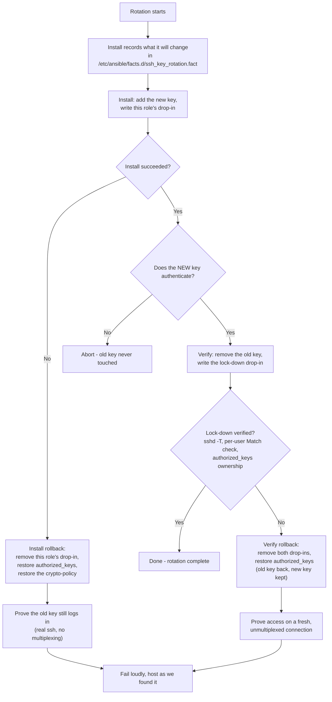

<p align="center">
  
  
</p>

# SSH Key Rotation Collection

An Ansible collection for rotating SSH keys across your infrastructure without breaking existing connections.

> **Warning**
>
> As with anything you download, test this thoroughly against a disposable host before running it anywhere that matters. A VM snapshot you can roll back is ideal.
>
> The collection is built with multiple safety gates (see [Safety model](#safety-model)), but no automated tool can guarantee it fits every environment, and SSH lockouts are painful to recover from.

## Contents

- [How it works](#how-it-works)
- [Features](#features)
- [Requirements](#requirements)
- [Tested platforms](#tested-platforms)
- [Installation](#installation)
- [Usage](#usage)
- [Variables](#variables)
- [Key validation](#key-validation)
- [Drop-in overrides](#drop-in-overrides)
- [Post-quantum algorithms](#post-quantum-algorithms) (full detail in [PQC.md](PQC.md))
- [Safety model](#safety-model)
- [Limitations](#limitations)
- [What each phase does](#what-each-phase-does)
- [Role reference](#role-reference)
- [Troubleshooting](#troubleshooting)
- [Development](#development)

## How it works

Rotating SSH keys is easy to get wrong in a way that locks you out of a server. This collection splits the job into three phases so that a mistake at any point fails safely instead of leaving a host unreachable.

**Phase 0: validate.** Runs entirely on the control node, before touching a single host. Checks that the required variables are set, that the new key is a recognised and strong type, and that the new private key really matches the public key file.

**Phase 1: install.** Connects with the old key, installs the new key alongside it, and makes sure public key authentication is enabled.

**Phase 2: verify.** Reconnects using the *new* key to prove it works. Only then does it remove the old key and disable legacy auth methods.

The old key is never touched until the new one has proven it can authenticate. If Phase 2 cannot connect with the new key, the playbook stops there and makes no further edits to `authorized_keys` or `sshd_config` on that host.

Every `sshd_config` change is checked with `sshd -t` before it is written, and both `sshd_config` and `authorized_keys` are backed up first, so a bad change can always be reverted by hand.

## Features

**Zero downtime.** Configuration is applied with an `sshd` reload rather than a restart, so existing SSH sessions survive the change.

**Key recognition checks.** Deprecated key types, weak key types and undersized RSA keys are rejected before anything is rotated. See [Key validation](#key-validation).

**A hard safety gate.** The new key must authenticate before the old one is removed.

**Cross-OS support.** The Debian/Ubuntu vs RHEL/CentOS `sshd` service-name difference is handled for you.

**Lock-down is verified, not assumed.** After disabling password and keyboard-interactive auth, the playbook re-reads `sshd -T` and fails if either is still enabled, so a drop-in file cannot quietly leave password login working on a run that reported success.

**Drop-in and `Match` block awareness.** Warns about files in `/etc/ssh/sshd_config.d/` that could override the main config, and verifies the lock-down applies to the rotated user specifically, so a `Match User` block re-enabling password login is caught rather than missed. Optionally writes its own drop-in so the lock-down wins outright. See [Drop-in overrides](#drop-in-overrides).

**Flexible auth policy.** Optionally make the new key exclusive, and optionally disable password and keyboard-interactive auth.

**Validated, backed-up config edits.** Every `sshd` change is checked with `sshd -t` and backed up before it is written.

**Post-quantum negotiation, opt-in.** Can enable post-quantum and hybrid key exchange and signature algorithms across `sshd_config`, RHEL/Fedora crypto-policy, and the control node's own ssh client. See [PQC.md](PQC.md).

## Requirements

- Ansible 2.18 or later
- `ansible.posix` 1.3.0 or later

```bash
ansible-galaxy collection install ansible.posix
```

## Tested platforms

The collection targets Debian/Ubuntu and RHEL/Fedora-family hosts generally. These are the specific versions it has been run against end to end, on real hosts:

| OS | Notes |
|----|-------|
| Ubuntu 22.04 LTS (Jammy Jellyfish) | Watch for `sshd_config.d/` drop-ins such as cloud-init's `50-cloud-init.conf`, which can override settings written further down `sshd_config`. See [Drop-in sshd config files found](#drop-in-sshd-config-files-found). |
| Ubuntu 26.04 LTS, OpenSSH 10.2 | Ships `50-cloud-init.conf` with `PasswordAuthentication yes`, which overrides the lock-down. Phase 2 fails rather than reporting a success it did not achieve. Fix the drop-in and re-run. |
| Rocky Linux 9.8 (Blue Onyx), `FIPS` crypto-policy | `FIPS` excludes `ssh-ed25519`, so ed25519 keys are rejected. Use ECDSA or RSA. `FIPS` alone has no PQC key exchange; add it with `ssh_key_rotation_crypto_policy_add_modules: [PQ]`. |
| AlmaLinux 9.8 (Olive Jaguar), `FIPS` crypto-policy | `FIPS` on its own has no PQC key exchange. Use `ssh_key_rotation_crypto_policy_add_modules: [PQ]` to add it. See [Combining a base policy with a subpolicy module](PQC.md#combining-a-base-policy-with-a-subpolicy-module). |
| AlmaLinux 10.1 / 10.2 (Lavender Lion), `FIPS` crypto-policy | `FIPS` already includes PQC key exchange here. No extra module needed. As on 9.x, ed25519 is not accepted under FIPS. |
| openSUSE Leap 15.6 | Ships Python 3.6 by default, which is too old for Ansible 2.15+ on the target side. Set `ansible_python_interpreter` to a Python 3.7+ install, for example `python39` via `zypper`. |

Container-based tests (`molecule`) additionally cover Ubuntu 22.04, Rocky Linux 9 and Rocky Linux 10,
rotating both `root` and a non-root user.

Other versions in the same families are likely to work, since nothing here relies on version-specific behaviour beyond what is called out above. They have not been explicitly verified.

## Installation

```bash
# From Galaxy
ansible-galaxy collection install krameff.ssh_key_rotation

# From a tarball or directory
ansible-galaxy collection install /path/to/krameff-ssh_key_rotation-0.9.0.tar.gz
```

## Usage

New to this? [QUICKSTART.md](QUICKSTART.md) walks through a first rotation end to end.

### Set up once

The playbook runs against the `rotate` host group, which you define in your inventory:

```ini
[rotate]
prod-web-01 ansible_host=10.0.1.10
prod-web-02 ansible_host=10.0.1.11
prod-db-01 ansible_host=10.0.2.10
```

Every rotation needs four paths, all on the control node. Keep them in a vars file rather than
retyping four `-e` flags each time:

```bash
cp rotation_vars.example.yml rotation_vars.yml   # then edit the four paths
```

```yaml
old_private_key:     "~/.ssh/id_old"
old_public_key_file: "~/.ssh/id_old.pub"
new_private_key:     "./pwc_id_ed25519"
new_public_key_file: "./pwc_id_ed25519.pub"
```

Your copy is gitignored. Everything in [Variables](#variables) can go in the same file.

### Run it

```bash
ansible-playbook krameff.ssh_key_rotation.rotate \
  -i inventory.ini -e @rotation_vars.yml --ask-become-pass
```

The four paths can still be passed as `-e old_private_key=...` if you prefer; the vars file is
only a convenience.

### Common variations

Each of these is a line to add to `rotation_vars.yml`. Nothing else about the command changes.

```yaml
# Disable password auth but keep keyboard-interactive
ssh_key_rotation_disable_password_auth: true
ssh_key_rotation_disable_kbd_interactive: false

# Keep the old key in place alongside the new one
ssh_key_rotation_make_exclusive: false

# Leave ONLY the new key in authorized_keys
ssh_key_rotation_make_exclusive: true

# Rotate a specific account rather than the inventory's ansible_user
ssh_key_rotation_target_user: "ubuntu"
```

## Variables

Any of these can go in `rotation_vars.yml` (see [Usage](#usage)) or be passed with `-e`.

### Required

All four are paths on the **control node**, not on the targets.

| Variable | Type | Description |
|----------|------|-------------|
| `old_private_key` | string | Path to the old SSH private key, on the control node |
| `new_private_key` | string | Path to the new SSH private key, on the control node |
| `old_public_key_file` | string | Path to the old SSH public key, on the control node |
| `new_public_key_file` | string | Path to the new SSH public key, on the control node |

These have no defaults, deliberately. A default in `defaults/main.yml` would count as "defined"
and permanently disable the Phase 0 check that catches a missing or misspelled path before any
host is touched. Copy `rotation_vars.example.yml` instead.

### Optional

| Variable | Type | Default | Description |
|----------|------|---------|-------------|
| `ansible_user` | string | `$USER` | Remote user to rotate keys for |
| `ssh_key_rotation_disable_password_auth` | bool | `true` | Disable password authentication after rotation |
| `ssh_key_rotation_disable_kbd_interactive` | bool | `true` | Disable keyboard-interactive auth after rotation |
| `ssh_key_rotation_make_exclusive` | bool | `false` | Leave only the new key in `authorized_keys` |
| `ssh_key_rotation_sshd_dropin_prefix` | string | `"99"` | Numeric prefix for this role's drop-ins. Lower wins. See [Drop-in overrides](#drop-in-overrides) |
| `ssh_key_rotation_sshd_dropin_dir` | string | `/etc/ssh/sshd_config.d` | Where this role writes its configuration |
| `ssh_key_rotation_manage_sshd_dropin` | bool | `false` | Deprecated: equivalent to a prefix of `01`, making this role outrank administrator drop-ins |
| `ssh_key_rotation_rollback_remove_new_key` | bool | `false` | On rollback, also restore the pre-install `authorized_keys`, removing the new key |
| `ssh_key_rotation_check_match_blocks` | bool | `true` | Check the lock-down applies to the rotated user specifically, catching a `Match` block that re-enables password auth for them |
| `ssh_key_rotation_accepted_key_types` | list | `[ED25519, ED25519-SK, ECDSA, ECDSA-SK, RSA]` | Key types allowed for `new_public_key_file` |
| `ssh_key_rotation_reject_key_types` | list | `[DSA]` | Key types that always fail validation, whatever the accepted list says |
| `ssh_key_rotation_min_rsa_bits` | int | `3072` | Minimum RSA key size accepted |
| `ssh_key_rotation_pqc_key_types` | list | `[]` | Forward-compatible allowlist for post-quantum signature key types. See [Key validation](#key-validation). |

### Optional, post-quantum

All of these are empty or false by default, so none of them change existing behaviour unless you ask for them. See [PQC.md](PQC.md).

| Variable | Type | Default | Description |
|----------|------|---------|-------------|
| `ssh_key_rotation_pqc_kex_algorithms` | list | `[]` | PQC or hybrid key-exchange algorithm names |
| `ssh_key_rotation_pqc_pubkey_algorithms` | list | `[]` | PQC or hybrid signature algorithm names for `PubkeyAcceptedAlgorithms` and `HostKeyAlgorithms` |
| `ssh_key_rotation_pqc_ca_signature_algorithms` | list | `[]` | PQC or hybrid algorithm names for `CASignatureAlgorithms`, for SSH CA setups only |
| `ssh_key_rotation_manage_crypto_policy` | bool | `false` | Manage the RHEL/Fedora system-wide crypto-policy on the control node and targets |
| `ssh_key_rotation_crypto_policy_setting` | string | `DEFAULT:PQ` | Value passed to `update-crypto-policies --set` |
| `ssh_key_rotation_crypto_policy_add_modules` | list | `[]` | Adds modules such as `PQ` onto whatever policy a host already has, instead of replacing it |

## Key validation

Before any host is touched, Phase 0 runs on the control node and checks that:

1. All four required variables are set. This fails fast with a clear message rather than a deep "undefined variable" error.
2. The type of `new_public_key_file`, read via `ssh-keygen -l`, is not in `ssh_key_rotation_reject_key_types`, for example `ssh-dss`/DSA.
3. That type is in `ssh_key_rotation_accepted_key_types` or `ssh_key_rotation_pqc_key_types`.
4. If it is an RSA key, it meets `ssh_key_rotation_min_rsa_bits`.
5. `new_private_key` and `new_public_key_file` are genuinely a matching pair, by comparing fingerprints. This catches the common mistake of pointing at mismatched key files.

### A note on post-quantum keys

Mainline OpenSSH does not yet ship a post-quantum *signature* algorithm for `authorized_keys` or host keys. It only ships post-quantum *key exchange* for the transport layer, namely `mlkem768x25519-sha256` and `sntrup761x25519-sha512`. See [openssh.org/pq.html](https://www.openssh.org/pq.html).

So there is no standard "PQC key" to check for yet. `ssh_key_rotation_pqc_key_types` exists as a forward-compatible allowlist. Once OpenSSH, or an [OQS-OpenSSH](https://github.com/open-quantum-safe/openssh) build, reports a PQC signature type such as `MLDSA65` or `FALCON1024` from `ssh-keygen -l`, add that name to `ssh_key_rotation_pqc_key_types` and it will be accepted. No other change is needed.

### The Phase 1 algorithm check

After reloading `sshd`, Phase 1 runs `sshd -T` on the target, extracts the effective `PubkeyAcceptedAlgorithms` list, and fails the host if none of the new key type's real signature algorithms are in it. For an ED25519 key, that means looking for `ssh-ed25519`.

This matters because a system-wide crypto-policy can quietly narrow what the Phase 0 type check would otherwise accept. RHEL and Fedora's `FIPS` policy, for instance, drops `ssh-ed25519` entirely and allows only `ecdsa-sha2-*` and `rsa-sha2-*`.

Without this check, Phase 1 would report success and Phase 2 would go on to remove the old key, leaving the host with no key it can actually authenticate with. The check runs, and can fail the host, before Phase 2 does anything destructive.

## Post-quantum algorithms

Opt-in, and off by default. The collection can enable post-quantum and hybrid key exchange and
signature algorithms across the target's `sshd_config`, the RHEL/Fedora system-wide crypto-policy,
and the control node's own ssh client.

If you need it, it is all on one page: **[PQC.md](PQC.md)**. It covers the variables, where each
piece runs across the three phases, and how `FIPS:PQ`-style crypto-policy modules work.

Note that `ssh_key_rotation_pqc_key_types` only affects local key *type* recognition in Phase 0.
It does not change what `sshd` and `ssh` actually negotiate on the wire; that needs the algorithm
variables described in PQC.md.

## Drop-in overrides

Worth understanding before you rely on the lock-down, because the rule is the opposite of what
most people assume.

Every mainstream distribution now starts `/etc/ssh/sshd_config` with:

```
Include /etc/ssh/sshd_config.d/*.conf
```

and **sshd keeps the first value it sees for a keyword**. Not the last. Because the `Include`
is at the top, a drop-in beats anything written further down the main file, and among drop-ins
the lowest-sorting filename wins. Verified on Ubuntu 26.04: against a `50-cloud-init.conf`
containing `PasswordAuthentication yes`, a `99-*.conf` setting it to `no` has no effect, while
an `01-*.conf` does.

This matters because Ubuntu cloud images ship exactly that `50-cloud-init.conf`. Editing only the
main `sshd_config`, as this role does by default, leaves password login enabled on those hosts.

**This role writes drop-ins too, and never edits your `sshd_config`.** On any host with an
`Include` line it writes two files:

```
/etc/ssh/sshd_config.d/99-ssh-key-rotation.conf           # install stage
/etc/ssh/sshd_config.d/99-ssh-key-rotation-lockdown.conf  # verify stage
```

Two files rather than one so that a verify-stage rollback cannot delete install-stage settings a
previous run legitimately established. Hosts older than OpenSSH 8.2 have no `Include`, so there the
role falls back to a marked block inside `sshd_config`, backed up first.

The `99-` default is chosen so **your** drop-ins still outrank this role's. That keeps your intent
authoritative, and it is what lets Phase 2 detect a conflict and fail loudly rather than quietly
working around you. If a drop-in of yours defeats the lock-down you have two options:

**Fix the drop-in yourself** and re-run. Best when it is something you manage.

**Let the role outrank it,** by lowering the prefix:

```yaml
ssh_key_rotation_sshd_dropin_prefix: "01"
```

Understand the trade before you do. At `01-` this role's files win, which also means the
"lock-down did not take effect" check can no longer detect a conflicting drop-in - the role's file
always wins, so the check becomes a formality. It is also why the role never manages
`AuthorizedKeysFile`: at that precedence it would override a central key store such as
`AuthorizedKeysFile /etc/ssh/authorized_keys/%u` and strip key access from every *other* user on
the host, while the rotated user kept working. The role reads that setting and fails instead.

### Match blocks

A `Match` block is a separate problem with the same shape. `sshd -T` on its own reports the global
configuration and does not evaluate `Match` at all, so a block like:

```
Match User deploy
    PasswordAuthentication yes
```

leaves password login working for exactly the account you just rotated, while the global check
says it is disabled. Phase 2 therefore also runs `sshd -T -C user=<target>,...`, which does
evaluate `Match`, and fails if password or keyboard-interactive auth is still enabled for that
user. Turn it off with `ssh_key_rotation_check_match_blocks: false` if `sshd -T -C` misbehaves on
your hosts.

**The role never edits a `Match` block.** Everything it writes to `sshd_config` goes into two
clearly marked blocks in the global section:

```
# BEGIN krameff.ssh_key_rotation install
# BEGIN krameff.ssh_key_rotation lock-down
```

Both are anchored immediately after the `Include` line, or before the first `Match` on hosts with
no `Include`. If a `Match` block contradicts what the role set, the role reports it and stops
rather than editing someone's per-user policy. See [Limitations](#limitations).

## Safety model

The point of this playbook is that you should not be able to lock yourself out by running it. That comes down to a handful of rules it never breaks.

**Nothing touches a live host until the new key has passed local checks.** Phase 0 verifies the new key's type, its strength, and that it genuinely pairs with the private key you gave it.

**Phase 1 confirms the target will actually accept the key type.** It reads the effective `PubkeyAcceptedAlgorithms` from `sshd -T`, after any crypto-policy has been applied, and fails the host before Phase 2 runs if there is no real signature algorithm for the new key's type. A key type can pass Phase 0's local checks and still be rejected by a target's crypto-policy, so this catches the problem before the old key is touched.

**The new key is proven to work before anything old is removed.** Phase 2 opens by resetting the connection and reconnecting with the new key. If that fails, the playbook aborts on that host and none of the cleanup tasks run.

Resetting the connection first matters if your `ansible.cfg` enables SSH `ControlPersist`. That multiplexes connections by host, port and user, not by identity file, so without the reset, Phase 2 could silently ride on Phase 1's still-open connection instead of genuinely testing the new key.

**The lock-down is checked after the fact, not assumed.** `sshd_config` has `Include /etc/ssh/sshd_config.d/*.conf` at the top on every mainstream distribution, and sshd honours the *first* value it sees for a keyword. A drop-in therefore beats anything this playbook writes further down the file. Phase 2 re-reads `sshd -T` after its edits and fails, naming the problem, rather than reporting a lock-down that did not happen. This is a global check: `sshd -T` without `-C` does not evaluate `Match` blocks, which is why those get their own warning in Phase 1.

**`authorized_keys` ownership is checked, on both the success and the rollback path.** sshd's `StrictModes` silently ignores an `authorized_keys` file that is not owned by the target user, which rejects every key at once. Because the playbook does its file work under `become`, ownership is set explicitly and then asserted.

**Connectivity checks reconnect from scratch.** Every check that claims a key still works first resets the connection, so it cannot pass by riding an SSH `ControlPersist` session opened earlier in the run.

**Every `sshd_config` change is validated with `sshd -t` before it is written.**

**Configuration is applied with a reload, never a restart,** so sessions already open stay open.

**`sshd_config` and `authorized_keys` are backed up before every edit,** so you can always roll back by hand.

### What a failed run undoes



Note what is *not* in the diagram: editing `/etc/ssh/sshd_config`. On any host with an `Include`
line the role only ever adds and removes its own files, which is what makes "undo" a deletion
rather than a restore.

**A failed run puts the host back.** Both the install and the verify stage roll back their own
changes: this role's drop-ins are removed (or restored, if a file was already at that path), and
`authorized_keys` is restored from the backup taken before the run. What each stage actually did is
recorded on the host at `/etc/ansible/facts.d/ssh_key_rotation.fact`, so the rollback undoes exactly
that rather than guessing - and so it still works when the verify stage is run on its own.

Two deliberate exceptions. The new key is **left** in `authorized_keys` by default: it is a
credential you hold, and removing it would mean relying on the old key still working, which is not
guaranteed. Set `ssh_key_rotation_rollback_remove_new_key: true` to restore the file exactly, in
which case the old key is proven to work *before* anything is removed, and kept if that proof fails.
The state file and the timestamped backups are also left behind, as the record of what happened.

**Rollback proves access with a real SSH connection.** Not `ansible.builtin.ping`: Ansible
multiplexes connections on host, port and user rather than on the identity file, so a ping can
succeed over a socket opened with a different credential and report access that no longer exists.
The check runs a real `ssh` with `ControlMaster=no` and `ControlPath=none`.

**Phase 2's cleanup runs inside a `block`/`rescue`.** If removing the old key or disabling legacy auth fails partway through, `rescue` restores `authorized_keys` and `sshd_config` from the backups just taken, reloads sshd, re-confirms connectivity, and fails with a clear message. All of that happens on the same still-open connection, before it could be lost.

A reload that itself fails does not abort the rollback. The restored files are already on disk and sshd reads `authorized_keys` per connection, so the rollback finishes and the failure message tells you to reload sshd by hand.

## What each phase does

### Phase 0: validate locally

1. Assert `old_private_key`, `new_private_key`, `old_public_key_file` and `new_public_key_file` are set.
2. Inspect the type, size and fingerprint of `new_public_key_file`.
3. Reject weak or deprecated types and undersized RSA keys.
4. Confirm `new_private_key` and `new_public_key_file` are a matching pair.

### Phase 1: install the new key

1. Determine the sshd service name for the OS family. Debian uses `ssh`, others use `sshd`.
2. Back up `authorized_keys`, if it exists.
3. Add the new public key to `authorized_keys`, keeping the old key in place for now.
4. Enable `PubkeyAuthentication` in `sshd_config`, backing it up first.
5. Make sure `AuthorizedKeysFile` points at the default location, backing up first.
6. If requested, append PQC or hybrid algorithms to `sshd_config` and apply a RHEL/Fedora crypto-policy.
7. Look for drop-in config files and `Match` blocks that might quietly override what was just set.
8. Apply the sshd configuration changes.
9. Read the effective `PubkeyAcceptedAlgorithms` and `KexAlgorithms` from `sshd -T`, and fail the host if the new key's real signature algorithm is not among them. Any requested PQC algorithm that is still missing produces an informational warning.

### Phase 2: verify and clean up

1. Reset the connection, so nothing below can ride on a `ControlPersist` session left open from Phase 1.
2. Reconnect and gather facts with the new private key. This is the authentication gate.
3. Ping the host to confirm the new key works.
4. Assert the new key really authenticated before doing anything else.
5. Steps 6 to 10 run inside a `block`/`rescue`. If any of them fail, the backups taken below are restored, sshd is reloaded on a best-effort basis, connectivity is re-confirmed, and the play fails with a clear message rather than leaving the host half-changed.
6. Back up `authorized_keys`, then remove the old public key from it.
7. Optionally make `authorized_keys` exclusive to the new key.
8. Disable password and keyboard-interactive auth if requested, backing up `sshd_config` first.
9. Apply the final sshd configuration.
10. Re-read `sshd -T` and confirm password and keyboard-interactive auth really are disabled, failing if a drop-in overrode them.
11. Confirm `authorized_keys` is still owned by the target user and not group- or world-writable, so sshd's `StrictModes` will honour it.
12. Reset the connection and run one last connectivity check, so it re-authenticates rather than reusing the open session.

## Role reference

All the logic lives in the `ssh_key_rotation` role, under `roles/ssh_key_rotation/`, following the standard Ansible role layout:

| Path | Purpose |
|------|---------|
| `defaults/main.yml` | Every optional variable in this README, with its default value |
| `handlers/main.yml` | The single `Reload sshd` handler, shared by the install and verify stages |
| `tasks/validate.yml` | Phase 0: local pre-flight validation, no remote connections |
| `tasks/install.yml` | Phase 1: connect with the old key, install the new key, prepare sshd |
| `tasks/verify.yml` | Phase 2: reconnect with the new key to prove it works, then remove the old key and legacy auth |
| `tasks/manage_crypto_policy.yml` | RHEL/Fedora crypto-policy management, included by both the validate and install stages |
| `meta/main.yml` | Role metadata: supported platforms, minimum Ansible version |

There is deliberately no `tasks/main.yml` entry point, because each stage authenticates differently. Validate runs locally, install uses the old key, and verify uses the new key. The role must be included with an explicit `tasks_from`.

`playbooks/rotate.yml` is the entry point that ties the three stages together as three separate plays, since each needs a different host and connection context:

```yaml
- hosts: localhost
  tasks:
    - ansible.builtin.include_role: {name: ssh_key_rotation, tasks_from: validate}

- hosts: rotate
  vars:
    ansible_ssh_private_key_file: "{{ old_private_key }}"
  tasks:
    - ansible.builtin.include_role: {name: ssh_key_rotation, tasks_from: install}

- hosts: rotate
  vars:
    ansible_ssh_private_key_file: "{{ new_private_key }}"
  tasks:
    - ansible.builtin.include_role: {name: ssh_key_rotation, tasks_from: verify}
```

## Limitations

Worth knowing before you rely on this in production. None of these cause silent failures: where
the role cannot do something, it stops and says so rather than reporting a success it did not
achieve.

**`Match` blocks are never edited.** Everything written to `sshd_config` goes into two marked
blocks in the global section. This is deliberate. A `Match` block is a per-user or per-address
policy someone set on purpose, and `PubkeyAuthentication`, `AuthorizedKeysFile`,
`PasswordAuthentication` and `PubkeyAcceptedAlgorithms` are all legal inside one. If a `Match`
block contradicts the lock-down, Phase 2 fails and names it; fix the block by hand and re-run.

**The `Match` check evaluates one connection profile, not all of them.** Phase 2 runs
`sshd -T -C user=<target>,host=localhost,addr=<client address>`. That catches `Match User` and
`Match Address` blocks affecting the rotation's own connection. A block keyed on something else,
such as `Match LocalPort` or an address range the rotation did not come from, is not evaluated
and could still apply to a future login.

**Your drop-in files are never modified.** The role adds its own files under
`/etc/ssh/sshd_config.d/` and removes them again on rollback, but it will not edit a drop-in you
already have. If one at its own path already exists it is backed up and restored rather than
deleted. See [Drop-in overrides](#drop-in-overrides).

**Crypto-policy changes are not rolled back byte-for-byte.** `update-crypto-policies --set`
regenerates `/etc/crypto-policies/back-ends/*`, so restoring the previous policy *name* does not
restore files an administrator hand-edited underneath it. The control node's own policy, if
`ssh_key_rotation_manage_crypto_policy` changed it, is not restored at all.

**The state file is left on the host** at `/etc/ansible/facts.d/ssh_key_rotation.fact`, deliberately.
It records what the last run changed, which is what makes a later recovery possible once the
original connection is gone.

**Only one account is rotated per run,** the one in `ssh_key_rotation_target_user`. Other users'
`authorized_keys` files are untouched.

**Recovery depends on the connection staying up.** Phase 2's rollback restores `authorized_keys`
and `sshd_config` over the connection it already holds. If that connection is lost at the wrong
moment, there is no remote path back in; you need console access. This is why the collection
insists on proving the new key before removing the old one, and why a snapshot is worth taking.

**`sshd -T` is trusted for verification.** Where a host's `sshd -T` cannot run at all, the
lock-down checks are skipped with a warning rather than failing the run, since the alternative is
rolling back a rotation that actually succeeded.

## Troubleshooting

### Phase 0 validation failures

These all happen before any host is touched, so there is no risk of a lockout while you fix them.

**"is in ssh_key_rotation_reject_key_types"** - the new key's type, DSA for example, is explicitly blocked. Generate a new key with a stronger algorithm.

**"not in ssh_key_rotation_accepted_key_types or ssh_key_rotation_pqc_key_types"** - the type is not recognised. Either generate an accepted key type, or add the type to one of those two lists.

**"RSA key; minimum accepted is ... bits"** - regenerate with `ssh-keygen -t rsa -b 4096`, or switch to `ed25519`.

**"does not match new_public_key_file"** - `new_private_key` and `new_public_key_file` are not actually a matching pair. Double-check both paths.

### "sshd -T ... does not include any signature algorithm for a ... key"

Phase 1 aborted before touching the old key. The target's effective `PubkeyAcceptedAlgorithms`, read from `sshd -T` after any crypto-policy was applied, does not include a real signature algorithm for your new key's type.

The most common cause is a system-wide crypto-policy narrowing what is accepted. RHEL and Fedora's `FIPS` policy, for instance, allows only `ecdsa-sha2-*` and `rsa-sha2-*`, so an `ed25519` key will always be rejected there even though Phase 0's local checks consider it a perfectly good key type.

Nothing has been broken and the old key is still in place. To fix it, either:

1. Generate a key type the target's policy accepts. Check with `ssh <host> sudo sshd -T | grep -i pubkeyacceptedalgorithms`, then for example `ssh-keygen -t ecdsa -b 256`.
2. Adjust the crypto-policy itself via `ssh_key_rotation_manage_crypto_policy` and `ssh_key_rotation_crypto_policy_setting`, if the type you want should be allowed.

This check exists because an earlier version of the playbook did a substring search across the entire `sshd -T` output for the key type name. That produced false negatives: a `hostkey /etc/ssh/ssh_host_ed25519_key` line would satisfy a check for `ed25519` even when `PubkeyAcceptedAlgorithms` did not include `ssh-ed25519` at all, and Phase 2 would go on to remove the old key regardless. See [CHANGELOG.md](CHANGELOG.md) for details.

### "New key did not authenticate"

Phase 2 could not connect with the new key. Things to check:

1. **Key paths are correct.** Double-check `-e new_private_key` and `-e new_public_key_file`.
2. **Key formats match.** The private key type has to match the public key: both ed25519, both rsa, and so on.
3. **File permissions.** The new private key needs to be readable by the Ansible user.
4. **The public key was installed.** Phase 1 must have completed successfully. Check the key is actually in `~/.ssh/authorized_keys` on the target.
5. **The target's crypto-policy accepts the key type.** See the section above. Phase 1 should already have caught this, but confirm with `sudo sshd -T | grep -i pubkeyacceptedalgorithms` on the target.

### "Drop-in sshd config files found"

A warning, not a failure. Phase 1 spotted override files in `/etc/ssh/sshd_config.d/`. Worth reviewing:

1. See what is there: `ansible all -i inventory.ini -m ansible.builtin.find -a "paths=/etc/ssh/sshd_config.d patterns='*.conf'" -b`
2. Make sure none of them re-enable `PasswordAuthentication yes` or similar.
3. If one does, fix it there before re-running. Phase 2 will fail rather than let it slide, as below.

### "sshd -T still reports password authentication as ENABLED"

Phase 2 disabled password auth in `/etc/ssh/sshd_config`, then re-read the effective config and
found it still on, so it rolled back and failed. The lock-down did not take effect.

Almost always a drop-in. `sshd_config` has `Include /etc/ssh/sshd_config.d/*.conf` at the top,
and sshd uses the **first** value it sees for a keyword, so a drop-in beats anything written
further down the main file. Ubuntu cloud images ship exactly this, as
`50-cloud-init.conf` containing `PasswordAuthentication yes`.

To fix, set the value in the winning drop-in, or remove it there, and re-run:

```bash
sudo grep -rn PasswordAuthentication /etc/ssh/sshd_config.d/
sudo sshd -T | grep -i passwordauthentication   # what is actually in effect
```

The rotation itself succeeded before this check; the rollback put the old key and the previous
`sshd_config` back, so the host is exactly as it started. If you would rather not disable
password auth at all on these hosts, set `ssh_key_rotation_disable_password_auth: false` and the
check is skipped with it.

### "StrictModes will ignore this file, rejecting every key for this user"

`~/.ssh/authorized_keys` is not owned by the user being rotated, or is group- or world-writable.
sshd refuses to read such a file at all, so *every* key for that account stops working, not just
the new one.

The playbook sets ownership explicitly and asserts it, so seeing this means something else on the
host changed it. Fix it directly:

```bash
sudo chown <user>:<group> ~<user>/.ssh/authorized_keys
sudo chmod 600 ~<user>/.ssh/authorized_keys
```

Check the backups beside it too (`authorized_keys.bak-*`), since those are what a future rollback
would restore from.

### PQC algorithms not negotiating

If Phase 1's post-reload check warns that `sshd -T` does not mention a requested PQC algorithm, or Phase 2 fails to authenticate with a PQC-type key, work through these in order:

1. Confirm the control node's ssh binary supports the algorithms you asked for. Phase 0 already checks this, but `ssh -Q kex` and `ssh -Q key-sig` will tell you directly.
2. Confirm the target's sshd build supports them too: `sshd -T | grep -i kexalgorithms`.
3. If `ssh_key_rotation_manage_crypto_policy` is set on a RHEL or Fedora host, check the policy actually changed: `update-crypto-policies --show`.
4. Look for a `50-redhat.conf` or other drop-in overriding your settings.

### "Desired crypto policy ... needs module(s) ... that were not found"

`ssh_key_rotation_crypto_policy_setting` named a `BASE:MODULE` combination such as `FIPS:PQ`, but that host has no matching `MODULE.pmod` file under `/usr/share/crypto-policies/policies/modules/` or `/etc/crypto-policies/policies/modules/`.

This is a hard stop before `update-crypto-policies --set` is ever called, on the control node in Phase 0 or the target in Phase 1, so nothing has changed on that host. To fix it:

1. List what is actually available: `ssh <host> ls /usr/share/crypto-policies/policies/modules/*.pmod /etc/crypto-policies/policies/modules/*.pmod`
2. Check for typos in the module name, or drop a custom `MODULE.pmod` into `/etc/crypto-policies/policies/modules/` if you need one the OS does not ship.
3. See [Combining a base policy with a subpolicy module](PQC.md#combining-a-base-policy-with-a-subpolicy-module) for why `FIPS:PQ` is the combination most people want on RHEL and AlmaLinux 9.

### "Permission denied" on Phase 1

Check that:

1. The old private key is readable and correct.
2. The remote user matches the one Ansible is actually using. Run with `-vvv` to confirm.
3. The SSH keys are not passphrase-protected, or use `SSH_ASKPASS` with `--ask-pass`.

### Module execution fails with "Operation not permitted" on a hardened host

If Ansible fails while gathering facts or running any module, not just this playbook, with an error like `can't open file '.../AnsiballZ_setup.py': [Errno 1] Operation not permitted`, the target likely has `/tmp`, `/var/tmp` or the user's home directory mounted `noexec`. That is a common CIS and STIG hardening baseline.

Ansible's default mechanism copies each module to a remote temp file and executes it, which a `noexec` mount blocks outright. Either:

1. Enable [pipelining](https://docs.ansible.com/ansible/latest/collections/ansible/builtin/ssh_connection.html#parameter-pipelining), with `pipelining = True` under `[ssh_connection]` in `ansible.cfg` or `ANSIBLE_PIPELINING=True`. This streams most modules over stdin instead of writing them to disk.
2. Point `remote_tmp` (`ansible_remote_tmp`) at a directory that is genuinely executable on that host, if one exists.

Pipelining is the more robust fix, since some hardening baselines make every writable path `noexec`.

## Development

```bash
# Build the collection
ansible-galaxy collection build .

# Test against a local VM, brought up however you like
ansible-playbook playbooks/rotate.yml -i 127.0.0.1, -e @rotation_vars.yml

# Run the container test suites
molecule test -s default    # full rotation, twice, proving idempotency
molecule test -s nonroot    # same, rotating a non-root user
molecule test -s rollback   # breaks a rotation mid-verify to prove access is restored
```

See [DEVELOPMENT.md](DEVELOPMENT.md) for the repository layout and release process.

## Contributing

Issues and bug reports are welcome and genuinely useful.

Pull requests are accepted from existing contributors only. If you would like to become one, email <github@krameff.com>.

See [CONTRIBUTING.md](CONTRIBUTING.md) for the full detail.

The short version for contributors:

- Playbooks pass `ansible-lint` and both Molecule scenarios
- Changes preserve the safety model, meaning the new key is proven before the old key is removed
- README.md and CHANGELOG.md are updated to match

## License

MIT

## Support

For issues and feature requests, see the [GitHub repository](https://github.com/krameff/ssh_key_rotation).
